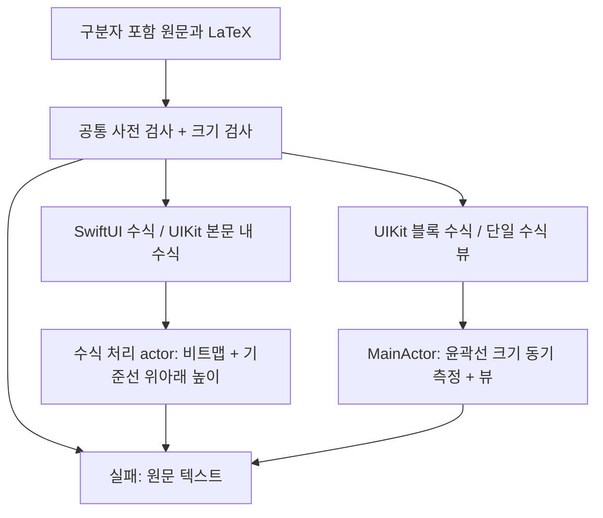

# ADR-0002: 수식 표시 위치에 맞게 비트맵과 윤곽선 표현을 나눈다

- 기준일: 2026-10-06
- 상태: 소급 기록 — 현재 구현 확인
- 근거: [MathRenderService](../../../Sources/RichMarkdown/MathRenderService.swift), [RichMarkdownUIView](../../../Sources/RichMarkdown/RichMarkdownUIView.swift), [RichMarkdownView](../../../Sources/RichMarkdown/RichMarkdownView.swift)

## 문제

본문 안에 놓는 수식(inline)은 주변 글자를 나란히 놓는 기준선(baseline)에 맞춰야 합니다. 독립 블록 수식(block)은 별도 뷰의 크기·가로 스크롤을 관리해야 합니다. 수식을 배치해 그리는 조판이 실패하거나 입력 상한을 넘었을 때 문서의 일부가 사라지면 호출 앱은 무엇을 표시하지 못했는지 알기 어렵습니다.

## 현재 선택

비트맵 이미지(raster)는 수식을 픽셀로 만들어 둔 그림이고, 윤곽선 그림(vector)은 선·글자 모양을 직접 그리는 표현입니다. SwiftUI의 본문 내·블록 수식은 RaTeX로 만든 비트맵을 사용합니다. UIKit의 본문 내 수식은 비트맵을 텍스트 안에 넣는 첨부 요소(attachment), 블록 수식은 UIKit 윤곽선 뷰를 사용합니다.

UIKit 블록 수식은 동기로 크기를 측정(measure)하므로, 모델 요청에서 독립 블록용 비트맵 생성(display raster)을 제외합니다.

본문 내 수식의 기준선은 `-descent`로 맞춥니다. descent는 기준선 아래로 내려가는 높이이며, 이 값만큼 위치를 보정해 주변 글자와 맞춥니다. 블록 수식은 원문 복사를 제공하며 실패 시 구분자 포함 원문(source)을 유지합니다.

단일 `LatexEquationUIView`는 머리 영역(header)·복사 버튼 없이, 표시 실패 시 원문으로 대체하는 처리(fallback)를 제공합니다.

## 대안과 의미

| 방식 | 유리한 점 | 제한 |
| --- | --- | --- |
| 현재 표시 위치별 비트맵/윤곽선 | 본문 내 첨부 요소와 독립 블록 뷰의 조건을 각각 만족 | 두 UI 표시 방식의 크기·대체 원문을 함께 관리 |
| 모든 위치에 비트맵 | 캐시·이미지 표현을 통일 | UIKit 블록도 먼저 원문을 보여 준 뒤 완성된 이미지로 채우는 처리(hydration)와 크기 변화에 의존 |
| 모든 위치에 윤곽선 | 이미지로 만드는 중간 단계를 줄임 | 현재 SwiftUI Text 결합·UIKit 본문 내 이미지 첨부 경로를 바꿔야 함 |

현재 선택은 UIKit 블록 수식의 측정·뷰 생성을 UI 상태를 담당하는 MainActor에서 동기로 수행합니다. 따라서 모든 LaTeX 작업이 UI 실행 문맥(executor) 밖에서 수행된다고 보장하지 않습니다. 현재 선택의 성능 효과를 이번 문서 작성에서 측정하지 않았습니다.

## 안전 경계와 접근성

계산 전 사전 검사(preflight)는 원문 바이트 수·폰트·배율(scale)·중괄호(brace) 중첩 깊이와 짝을 확인합니다. 조판 결과는 각 변의 픽셀 수와 전체 픽셀 수를 제한합니다. KaTeX 서체가 없거나 알 수 없는 그리기 명령이 있으면 일부만 그리는 대신 nil을 반환하며, 중괄호 깊이 검사만으로 TeX의 모든 구조를 검증했다고 볼 수는 없습니다.

수식 이미지·윤곽선 그림은 텍스트가 아니므로 원문 기반 접근성 이름(label)을 제공합니다. 링크가 있는 문단에서는 문단 전체를 묶은 이름으로 개별 링크의 접근성 정보(link semantics)를 덮지 않습니다. 이미지 수식의 LaTeX 선택은 보장하지 않으며 블록 원문 복사를 별도로 제공합니다.

## 확인 근거

[MathRenderServiceTests](../../../Tests/RichMarkdownTests/MathRenderServiceTests.swift)의 `complexEquationsRenderAsNativeVectors`, `oversizedComplexLayoutFailsBeforeBitmapAllocation`, `invalidRasterParametersFailPreflight`와 [RichMarkdownUIViewTests](../../../Tests/RichMarkdownTests/RichMarkdownUIViewTests.swift)의 `rendersBlockMathAsVectorViewWithSynchronousSize`, `keepsBlockMathSourceWhenPreflightRejects`, `doesNotRasterBlockMath`는 위 규칙의 기대값을 확인하도록 작성되어 있습니다. 이번 작성에서는 실행하지 않았습니다.

[아키텍처](../architecture/RichMarkdown.md) · [명세](../spec/RichMarkdown.md) · [개선 기록](../improvements/RichMarkdown.md) · [ADR 목록](README.md#richmarkdown-adr)
