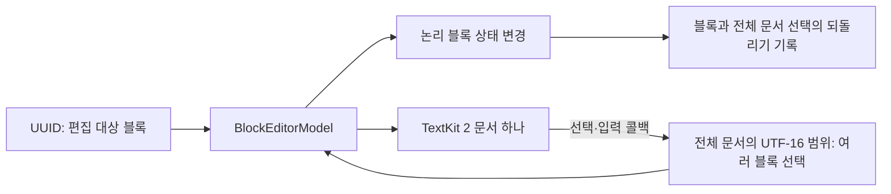

# ADR-0001: 논리 블록을 유지하고 TextKit 문서 하나로 편집한다

- 기준일: 2026-10-06
- 상태: **소급 기록 — 현재 구현 확인**
- 구현 검수: **구현·패키지 회귀 확인**
- 범위: 블록 모델, 선택 좌표, 입력 연결 처리(브리지), 되돌리기 기록(history)

## 배경

블록은 문단·제목·코드처럼 종류를 가진 내용 단위입니다. 문서는 블록마다 종류·들여쓰기·서식을 보관해야 하지만 사용자의 선택은 여러 블록에 걸칠 수 있습니다. 블록마다 독립 텍스트 뷰를 두면 전체 선택·복사·커서(caret) 이동을 블록 사이에서 추가로 연결해야 하므로, 현재 구현은 블록 구조와 화면의 연속 선택을 별도로 관리합니다.

## 현재 선택

앱은 `BlockEditorModel` 값과 선택(selection)을 소유하고, `BlockDocumentTextEditor`는 논리 블록(blocks)을 iOS 텍스트 배치 엔진인 TextKit 2의 문서 하나로 표시합니다. 입력 위치·길이는 전체 문서 기준의 UTF-16 범위(range)로 받은 뒤, 모델이 블록 분할(split)·병합(merge)·교체로 바꿉니다. 되돌리기(undo)·다시 실행(redo)는 이전 블록 상태를 보관한 스냅샷과 전체 문서 선택을 함께 복원합니다.

UTF-16은 16비트 단위로 문자열 위치를 세는 방식입니다. 예를 들어 `😀`는 화면에서 한 글자처럼 보이지만 두 단위를 차지하므로, 화면 글자 수로 선택 범위를 계산하면 위치가 어긋날 수 있습니다.

모델의 ID와 화면 시작 위치(offset)는 다른 기준입니다. ID는 같은 블록을 찾는 기준이고 시작 위치는 현재 문자열 안의 좌표이므로, 앞부분 내용이 늘어나면 위치는 달라져도 블록 ID는 유지될 수 있습니다. 분할은 왼쪽 ID를 보존하고 오른쪽에 새 ID를 만들며, 병합은 앞 ID를 남깁니다.

Markdown을 다시 분석하거나 클립보드(pasteboard) 데이터를 복원(decode)할 때는 새 ID를 발급합니다.

## 비교안과 비용

| 방식 | 얻는 것 | 비용·제약 | 현재 선택과의 관계 |
| --- | --- | --- | --- |
| 논리 블록 + 단일 TextKit 문서 | iOS의 연속 선택·복사와 블록 편집 명령을 함께 사용 | 전체 문서·블록 안 범위 변환, 입력기 조합·수식 첨부 요소의 좌표 유지 필요 | 현재 구현 |
| 블록마다 텍스트 뷰 | 블록별 뷰·배치 분리가 쉬움 | 여러 블록 선택·키보드 이동·전체 복사를 별도로 연결 | 현재는 문서 단위 선택을 우선 |
| 원문 문자열만 편집 | 상태가 단순하고 Markdown 원문 표시가 자연스러움 | 블록 ID·종류별 명령·본문 일부 서식 범위를 매번 다시 계산 | 현재 제공하는 구조 편집과 다름 |
| 웹 기반 블록 에디터 | 브라우저의 문서 구조(DOM)와 편집 도구 사용 가능 | WebKit 수명·iOS 도구 모음·접근성과 웹/앱 데이터 연결 처리 추가 | 현재 패키지 구성품(product)에 포함하지 않음 |

표의 비용은 구조 설명이며 실제 성능 비교값이 아닙니다.

## 효과와 주의점

블록 상태 변화는 Foundation 모델에서 확인하고 테스트할 수 있으며 화면 표시는 앱이 소유한 모델 변경을 따라옵니다. 텍스트 뷰의 입력을 받는 객체(delegate)가 준 실제 편집 범위를 사용하고, 한글 등 입력기(IME)의 조합 중에는 스타일을 덮어쓰지 않습니다. 반복 문자와 한글 조합 위치를 보존하기 위한 처리입니다.

`currentSelection`은 선택 시작 블록만 표현합니다. 교차 블록 선택을 보존하려면 `currentDocumentSelection`을 사용해야 합니다. 블록 단위 API가 돌려준 새 선택은 앱이 `updateSelection`으로 적용해야 하고 모든 메서드가 자동으로 선택을 갱신하는 것은 아닙니다.

텍스트 문서에 삽입하는 수식 첨부 요소(attachment)는 원문 길이를 맞추기 위한 보충 문자를 포함합니다. 좌표 길이는 같아도 표시 문자열은 원문과 다르므로 저장용 원문은 모델에서 얻습니다. 블록 생성·직접 대입은 들여쓰기(indent) 0...3과 제목(heading) 1...3을 유지하도록 보완했습니다.

직접 입력한 ID의 중복은 검사하지 않으므로 앱이 같은 문서에서 구분되는 ID를 제공해야 합니다. 적용 범위는 [IE-01](../improvements/RichMarkdownBlockEditor.md#ie-01-직접-블록-생성의-들여쓰기-범위)에 기록했습니다.

공개 UTF-16 범위는 끝 위치(end)를 더하기 전에 음수·위치·길이를 검사합니다. 문자열 변환기(코덱), 모델, 스타일러, 입력기의 교체 문자열 처리(replacement)는 `EditorBlock.isValidRange`를 사용합니다. 서식 범위를 만들거나 직접 대입하면 기존 정규화 규칙으로 유효한 형태를 유지합니다.

모델은 잘못된 편집 범위를 거절하고 스타일러는 잘못된 선택을 무시합니다. 뷰는 좌표 정렬 전에 선택을 표시 문서 범위 안으로 제한(clamp)합니다. 이 보완은 원문·ID와 유효한 서식을 유지하며 새 선택 모델을 추가하지 않고, 적용 내용은 [IE-03](../improvements/RichMarkdownBlockEditor.md#ie-03-공개-utf-16-범위의-합계-검사)에 기록했습니다.

## 근거와 검증 상태

- [BlockEditorModel.swift](../../../Sources/RichMarkdownBlockEditor/BlockEditorModel.swift) — 문서 좌표 변환, 정규화, 편집 상태 변화, 되돌리기 기록
- [EditorBlock.swift](../../../Sources/RichMarkdownBlockEditor/EditorBlock.swift) — ID와 서식 값, 분할·병합
- [BlockDocumentTextEditor.swift](../../../Sources/RichMarkdownBlockEditor/BlockDocumentTextEditor.swift) — 단일 TextKit 2 뷰, 실제 편집 범위·입력기 조합 조정
- [MarkdownStyler.swift](../../../Sources/RichMarkdownBlockEditor/MarkdownStyler.swift) — 표시 문서·인라인 마크·선택 범위 방어
- [BlockEditorModelTests.swift](../../../Tests/RichMarkdownBlockEditorTests/BlockEditorModelTests.swift) — ID·Unicode·여러 블록 선택·되돌리기·입력기와 잘못된 공개 범위 회귀

숫자 경계에서 기존 구현이 실패함을 확인한 뒤 입력 처리를 수정했고, 공개 범위 검사 회귀 테스트를 추가했습니다. 수정 후 전체 패키지 테스트는 exit 0, 실패 테스트 0, 오류 0으로 완료되었습니다. 이후 번들 의존성 보안 변경을 포함한 최종 패키지·Demo 재검수와 배포 판정은 [릴리스 검수 기록](../validation.md)에서 구분합니다.
