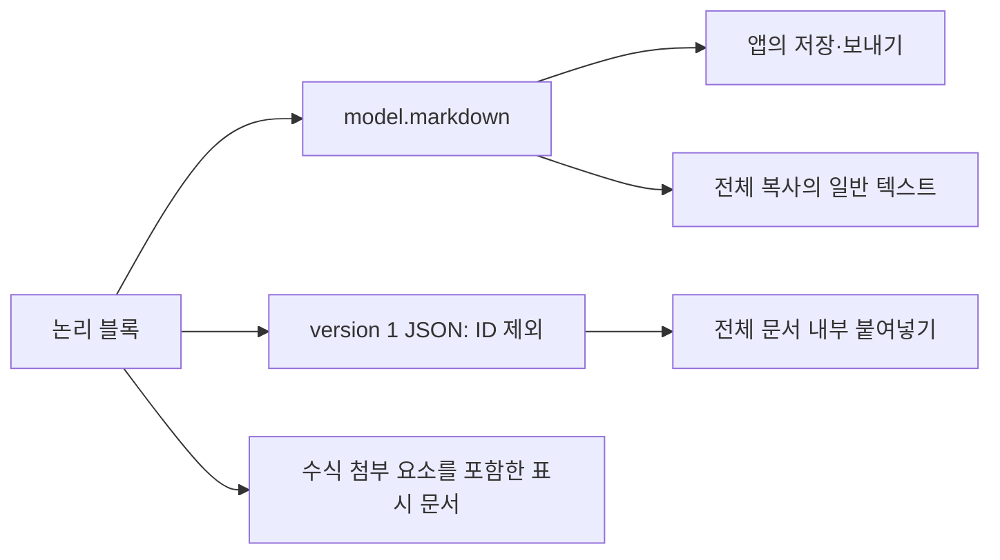

# ADR-0002: 저장 Markdown과 내부 복사용 블록 데이터를 구분한다

- 기준일: 2026-10-06
- 상태: **소급 기록 — 현재 구현 확인**
- 구현 검수: **구현·패키지 회귀 확인**
- 범위: Markdown 문자열 변환(직렬화), 수식 표시, 전체 문서 복사/붙여넣기(copy/paste)

## 배경

편집 화면에는 제목·목록을 나타내는 Markdown 마커가 문자로 보이지 않습니다. 선택하지 않은 수식은 텍스트 문서 안에 삽입하는 수식 첨부 요소(attachment)와 길이를 맞추는 보충 문자로 바뀔 수 있습니다. 따라서 텍스트 뷰에서 읽은 문자열은 저장·보내기 원문이 아닙니다.

문법 대신 문자 그대로(literal) 읽어야 하는 문단 시작 마커와 코드 블록 구분기호(fence)는 출력 처리(serializer)와 구문 분석기(parser)가 같은 규칙으로 다룹니다. 중간 빈 문단 개수·목록 이외 들여쓰기 같은 내부 구조는 복사할 실제 블록 데이터(payload)로 전달합니다.

## 현재 선택

저장·보내기용 문자열은 `BlockEditorModel.markdown`이 만듭니다. 전체 선택 복사는 앱이 전달한 `sourceMarkdown`을 일반 텍스트(plain text)로 싣고, 가능하면 version 1 JSON의 논리 블록 데이터도 함께 제공합니다. 전체 문서 내부 붙여넣기는 이 데이터의 종류·본문(text)·서식 범위(inlineMarks)·들여쓰기(indentLevel)를 직접 복원하며, 블록 UUID는 데이터에 저장하지 않습니다.

표시 문서에서 저장·전송으로 가는 연결을 두지 않은 이유는 표시 문자열이 모델 원문과 다를 수 있기 때문입니다. 앱의 저장·보내기 화살표는 어떤 데이터를 사용할지 설명하며, 패키지에 서버 전송 구현이 있다는 뜻은 아닙니다.

## 비교안과 비용

| 방식 | 얻는 것 | 비용·제약 | 현재 선택과의 관계 |
| --- | --- | --- | --- |
| 모델 Markdown + 내부 블록 복사 데이터 | 외부 텍스트 공유와 내부 구조 보존을 함께 제공 | 두 표현 관리, 버전·크기·범위 검사 필요 | 현재 구현 |
| 표시 문서 문자열 저장 | 코드가 짧음 | 블록 마커·수식 원문을 잃을 수 있음 | 저장 입력으로 사용하지 않음 |
| Markdown만 복사/붙여넣기 | 외부 앱과 주고받는 형태가 단순함 | 빈 문단 개수·목록 이외 들여쓰기 등 내부 구조를 모두 나타내지는 못함 | 외부 표현으로 유지하되 내부 전체 붙여넣기에 블록 데이터 추가 |
| 모델 전체를 영구 저장 | ID·전체 상태 보존 가능 | 저장 데이터 구조(schema), 형식 변경 시 이전 데이터 변환(migration), 되돌리기 기록(history) 정책 필요 | 현재 패키지는 영구 저장 포맷을 제공하지 않음 |

## 효과와 한계

본문 일부에 적용한 기울임(italic)은 `<em>`, 목록 기호(bullet)는 `-`로 출력하며 번호 목록은 다시 계산합니다. 지원하는 인라인 서식의 범위는 패키지가 정한 일관된 표기(canonical)로 출력한 뒤 다시 분석해도 보존하도록 구현되어 있습니다. 원본 공백·번호·구분자·UUID 또는 모든 CommonMark 문서의 바이트 동일성은 보장하지 않습니다.

블록 복사 데이터를 복원(decode)할 때는 최대 256 KiB, version 1, 비어 있지 않은 blocks 조건을 검사하고 제목(heading)·들여쓰기(indent)를 제한합니다. `replaceDocumentBlocks`는 전체 문서 선택만 받으며 부분 문서 붙여넣기의 구조 병합은 제공하지 않습니다. 블록 데이터를 사용할 수 없으면 UIKit 기본 붙여넣기로 돌아갑니다.

일반 문단(paragraph)의 제목·목록·번호·인용 시작 마커에는 문법으로 해석하지 않도록 역슬래시를 넣는 처리(escape)를 적용하고, 인라인 코덱은 읽을 때 이를 해제합니다. 문단의 인라인 서식을 출력한 결과가 `\[`로 시작하고 `\]`로 끝나면 양끝 역슬래시(backslash)도 처리해 블록 수식으로 바뀌지 않게 합니다. 실제 수식(equation) 블록의 출력은 유지합니다.

코드 외부 구분기호는 본문 안에서 가장 길게 이어진 역따옴표(backtick)보다 길게 선택합니다. 블록 구문 분석기와 문서를 블록으로 나누는 처리기(splitter)는 같은 종료 규칙을 사용해, 짧은 구분기호나 구분기호 뒤에 다른 문자열(suffix)이 붙은 코드 줄을 본문으로 유지합니다. 적용 내용과 남은 지원 한계는 [IE-02](../improvements/RichMarkdownBlockEditor.md#ie-02-모호한-블록의-markdown-출력)를 참고합니다.

서식 범위 생성·직접 대입·복사 데이터 복원은 기존 인라인 정규화로 유효한 형태를 유지합니다. 범위 합계를 계산하기 전에 위치·길이가 본문 안인지 확인하므로 잘못된 큰 정수를 iOS 표시 API에 넘기지 않습니다. 이 보완은 복사 데이터의 version과 JSON 필드를 변경하지 않습니다.

범위 검사와 회귀 근거는 [IE-03](../improvements/RichMarkdownBlockEditor.md#ie-03-공개-utf-16-범위의-합계-검사)에 있습니다.

## 근거와 검증 상태

- [EditorBlock.swift](../../../Sources/RichMarkdownBlockEditor/EditorBlock.swift) — 블록 Markdown 출력·InlineMarkdownCodec
- [BlockEditorModel.swift](../../../Sources/RichMarkdownBlockEditor/BlockEditorModel.swift) — 일관된 목록 번호 출력·전체 블록 교체
- [BlockDocumentTextEditor.swift](../../../Sources/RichMarkdownBlockEditor/BlockDocumentTextEditor.swift) — 전체 복사/붙여넣기와 블록 데이터 검사
- [MarkdownStyler.swift](../../../Sources/RichMarkdownBlockEditor/MarkdownStyler.swift) — 수식 첨부 요소·길이 보충
- [BlockEditorModelTests.swift](../../../Tests/RichMarkdownBlockEditorTests/BlockEditorModelTests.swift) — 인라인 서식의 의미를 보존하는 재변환(roundtrip), 블록 수식 모양을 포함한 문자 그대로인 문단·가변 길이 코드 구분기호 재변환과 잘못된 서식 범위 회귀

초기 문단·코드 구분기호의 기존 구현 실패를 확인한 뒤 출력과 구문 분석을 함께 수정했습니다. 블록 수식 모양 문단과 공개 범위 검사 회귀도 포함하여 수정 후 전체 패키지 테스트가 exit 0, 실패 테스트 0, 오류 0으로 완료되었습니다. 이후 번들 의존성 보안 변경을 포함한 최종 패키지·Demo 재검수와 배포 판정은 [릴리스 검수 기록](../validation.md)에 남깁니다.

재변환은 `블록 → Markdown → 블록`을 거쳐 종류·본문·서식이 돌아오는지 확인하는 과정입니다. 이 모델 재변환·직접 블록 교체 테스트는 UIKit의 실제 복사/붙여넣기 재정의(override)를 실행해 확인한 것과 구분합니다.
