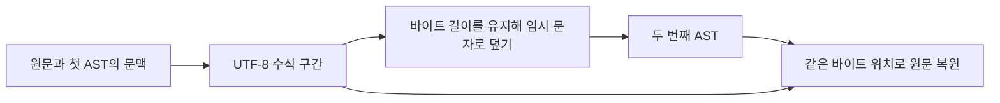

# ADR-0001: 원문 수식을 보호한 뒤 Markdown 모델을 만든다

- 기준일: 2026-10-06
- 상태: 소급 기록 — 현재 구현 확인
- 근거: [DocumentBuilder](../../../Sources/RichMarkdownCore/DocumentBuilder.swift), [MathScanner](../../../Sources/RichMarkdownCore/MathScanner.swift), [MathProtector](../../../Sources/RichMarkdownCore/MathProtector.swift)

소급 기록은 기존 구현을 읽고 그 선택을 나중에 정리한 문서를 뜻합니다. 당시의 검토 회의나 수치 평가를 복원한 기록은 아닙니다.

## 문제

수식 표기인 LaTeX와 Markdown은 `_`·`*`·`[]` 같은 기호를 서로 다른 의미로 사용합니다. 단순화한 예 `\(x_[i] + a * b\)`를 일반 Markdown으로 먼저 해석하면 수식 원문이 여러 부분으로 나뉠 수 있습니다. 반대로 원문에 있는 수식 시작·끝 기호를 모두 먼저 바꾸면 코드·HTML·링크 안의 기호를 잘못 수식으로 처리할 수 있습니다.

AST(추상 구문 트리)는 원문을 문단·링크·코드 등의 노드로 분석한 문서 구조입니다. 이 ADR(Architecture Decision Record, 아키텍처 결정 기록)은 수식을 보존하면서도 주변 Markdown 문맥을 확인하는 현재 선택을 설명합니다.

## 현재 선택

첫 번째 Markdown AST에서 코드·HTML·링크·이미지·문단의 범위만 수집합니다. `MathScanner`가 원문을 UTF-8 바이트 단위로 읽어 문맥에 맞는 수식 구간(span)을 정합니다. 그런 다음 수식 구간의 줄바꿈 CR·LF를 제외한 각 바이트를 ASCII `x`로 바꿔, Markdown이 수식 기호를 해석하지 못하게 합니다.

수식을 임시 문자로 덮는 작업을 마스킹(mask)이라고 하며, 결과를 담은 보호 버퍼는 글자 수가 아닌 UTF-8 바이트 길이를 보존합니다. 두 번째 AST의 범위를 원문의 같은 바이트 위치(offset)에 적용해 수식과 텍스트를 다시 나눕니다. 수식 원문에는 구분자가 남으므로 UI에서 수식을 그리지 못하면 해당 부분만 텍스트로 표시할 수 있습니다.

바이트 위치는 Swift `Character`나 UIKit의 UTF-16 `NSRange` 위치와 다릅니다. 예를 들어 한글이나 이모지는 글자 하나여도 UTF-8 여러 바이트를 차지하므로, 보호 과정에서 바이트 길이를 유지해야 뒤쪽 원문의 위치가 밀리지 않습니다.

## 대안과 의미

아래는 현행 코드를 설명하기 위한 대안 비교이며 당시 검토 기록이나 수치 평가가 아닙니다.

| 방식 | 유리한 점 | 제한 |
| --- | --- | --- |
| 현재 두 단계 파싱 | Markdown 문맥과 원문 수식 위치를 함께 보존합니다. | AST를 두 번 만들고 범위 복원 규칙을 관리해야 합니다. |
| 최종 AST의 Text만 수식 검색 | 구현 경로가 짧습니다. | 수식이 Markdown 노드로 나뉘면 원문 복원이 어렵습니다. |
| 문맥 확인 전 전체 원문 치환 | 전처리 자체는 단순합니다. | 코드·HTML·링크 내부 구분자를 수식으로 오인할 수 있습니다. |

## 결과와 제한

- 코드·HTML은 수식 검색의 제외 구간(hard barrier)입니다. 그 안에서 시작하거나 경계를 가로지르는 수식을 허용하지 않습니다. 링크·이미지는 조건부 제외 구간(soft range)이며, 수식 내용이 그 구간 전체를 감싼 경우에만 수식으로 인정합니다.
- 닫히지 않았거나 중첩된 구분자처럼 형식이 잘못된 수식은 원문과 내부 진단으로 남습니다. 수식 엔진이 실제 그림을 만들지 못하는 경우는 원문에서 수식을 찾는 판정과 별개입니다.
- `&amp;` 같은 HTML 문자 표기(entity) 주변 텍스트에는 원문과 충돌하지 않는 임시 표시자(marker)를 사용합니다. 수식 없는 일반 Text는 두 번째 AST가 문자 표기와 이스케이프를 해석한 문자열을 재사용합니다.
- CR·LF·CRLF 줄바꿈의 행·열 번호 변환은 원문 UTF-8 길이를 유지하며 CRLF를 한 행 종료로 셉니다. [CORE-IMP-01](../improvements/RichMarkdownCore.md#core-imp-01-단독-cr-줄바꿈-뒤의-위치-변환-기준)은 의존 라이브러리와 위치 기준을 맞춘 변경을 기록합니다.
- 수식 구간만 찾는 입구도 첫 AST 전에 바이트·인용 중첩 깊이 상한을 검사합니다. 원문 위치를 반환하는 API이므로 문서 전체 분석의 원문 잘림·생략 표시 대신 빈 배열 `[]`로 거절합니다. [CORE-IMP-02](../improvements/RichMarkdownCore.md#core-imp-02-수식-검색-전-인용-중첩-깊이-검사)를 참고하세요.

## 확인 근거

[MaskRoundTripTests](../../../Tests/RichMarkdownCoreTests/MaskRoundTripTests.swift)의 `restoreProtectRoundTripIsExact`, `multilingualSurroundingRangesPreserved`, `fuzzRoundTrip`, `lineMapMatchesDependencySourceLocations`가 보호·복원과 위치 기준의 기대값을 선언합니다. [MathScannerFixtureTests](../../../Tests/RichMarkdownCoreTests/MathScannerFixtureTests.swift)는 준비한 입력과 기대값(fixture)으로 문맥·수식 검색 제한을 검사합니다. 실행 결과는 [검수 기록](../validation.md)을 따릅니다.

[명세](../spec/RichMarkdownCore.md) · [ADR 목록](README.md#richmarkdowncore-adr)
