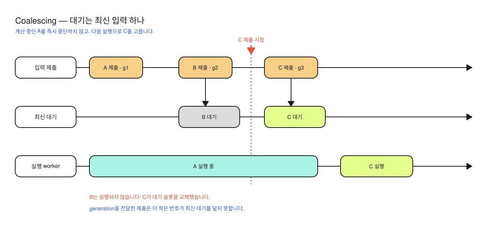

# ADR-0002: 요청 관리자는 실행 중 1건과 최신 대기 1건만 유지한다

- 기준일: 2026-10-06
- 상태: 소급 기록 — 현재 구현 확인
- 근거: [CoalescingWorker](../../../Sources/RichMarkdownCore/CoalescingWorker.swift), [RichMarkdownRenderModel](../../../Sources/RichMarkdown/RichMarkdownRenderModel.swift)

소급 기록은 기존 구현을 읽고 그 선택을 나중에 정리한 문서를 뜻합니다. 당시의 의사결정 과정이나 성능 비교를 확인한 기록은 아닙니다.

## 문제

스트리밍으로 누적 Markdown이 자주 갱신되면, 모든 중간 원문을 순서대로 처리하는 대기열은 이미 오래된 문서에도 계속 CPU를 씁니다. 단순화한 예로 A를 처리하는 동안 B와 C가 도착했다면, 화면에 표시할 최신 원문은 C이므로 B까지 계산할 필요가 없습니다.

UI 이벤트에서 별도로 생성한 비구조적 `Task`는 부모 작업의 범위에 묶인 자식 작업과 달리 수명을 따로 관리해야 합니다. 이 Task들이 상태를 관리하는 actor에 도착하는 순서도, 호출자가 붙인 요청 순서와 같다고 가정할 수 없습니다. actor는 공유 상태에 대한 접근을 보호하는 Swift 타입이며 전용 스레드 하나를 의미하지는 않습니다.

## 현재 선택

`CoalescingWorker` actor가 대기 입력 `pending` 하나를 관리합니다. 실행 중 1건과 최신 대기 1건만 유지하는 요청 합치기(coalescing) 방식입니다. 현재 작업 중 새 입력이 오면 대기 입력을 교체하고, 처리 반복문(drain loop)은 현재 작업이 끝난 뒤 최신 대기만 실행합니다.

`generation`은 호출자가 붙이는 요청 순서번호이고, high-water는 지금까지 받은 가장 큰 번호입니다. 요청번호를 받는 submit 함수(overload)는 이 최대 번호보다 큰 값만 받습니다. 중간에 `await`로 작업을 양보하지 않고 번호 검사와 대기 교체를 마치므로, 이 두 작업 사이에 다른 제출이 끼어들지 않습니다.

그림은 왼쪽의 실행 중 작업을 끝까지 유지하고, 대기 중인 중간 요청을 오른쪽의 최신 요청으로 교체하는 과정을 보여줍니다. worker가 실행 중인 작업을 취소한다는 뜻은 아닙니다.

요청번호 없는 함수 형태는 도착 순서의 최신 값을 택합니다. Render 모델이 사용하는 요청번호 포함 형태는 늦게 도착한 이전 요청이 최신 대기를 덮지 못하게 합니다. 예를 들어 요청번호 3을 받은 뒤 요청번호 2가 도착하면 2를 거절합니다.

## 대안과 의미

| 방식 | 유리한 점 | 제한 |
| --- | --- | --- |
| 현재 실행 1건 + 최신 대기 1건 | 중간 입력이 쌓이지 않게 하고 동시 실행 수를 제한합니다. | 실행 중 작업은 끝까지 수행될 수 있습니다. |
| 모든 요청을 도착 순서대로 처리(FIFO) | 모든 중간 결과를 계산합니다. | 표시할 필요 없는 과거 입력도 처리합니다. |
| 제출마다 새 Task 생성 | 제출 코드는 짧습니다. | CPU 중복 실행과 요청 순서가 뒤바뀐 완료를 별도로 관리해야 합니다. |
| 제출마다 취소·재시작 | 작업이 취소 요청을 확인하는 협조적 취소를 지원하면 낭비를 줄일 수 있습니다. | 동기 파서·엔진 호출의 중간 취소는 보장하지 않습니다. |

## 결과와 제한

worker는 동시에 처리할 요청 수를 제한하고, 결과를 화면에 반영해도 되는지는 Render 모델이 판단합니다. 실행 중 A가 끝날 때 최신 요청이 C이면, A 결과를 반영하지 않는 규칙은 호출자에서 확인해야 합니다. worker가 A를 취소하거나 결과를 자동 폐기한다고 해석하지 않습니다.

실행 중 작업과 대기 입력이 모두 없어지면 `hasOutstandingWork`가 false가 됩니다. 하지만 UI 요소를 다시 구성하는 작업과 크기 변경 콜백은 별도 상태입니다. 따라서 이 값만으로 화면 갱신까지 끝났다고 판정할 수 없습니다.

## 확인 근거

[CoalescingWorkerTests](../../../Tests/RichMarkdownCoreTests/CoalescingWorkerTests.swift)의 `latestWinsAndSingleConcurrency`, `submitAfterIdleRunsAgain`, `lowerGenerationCannotReplaceNewerPendingInput`이 관련 기대값을 선언합니다. [OffMainExecutionTests](../../../Tests/RichMarkdownCoreTests/OffMainExecutionTests.swift)는 worker 실행의 스레드 표본을 확인하도록 작성되어 있습니다. 이번 문서 윤문에서는 새로 실행하지 않았으며 기존 실행 결과는 [검수 기록](../validation.md)을 따릅니다.

[아키텍처](../architecture/RichMarkdownCore.md) · [명세](../spec/RichMarkdownCore.md) · [개선 기록](../improvements/RichMarkdownCore.md) · [ADR 목록](README.md#richmarkdowncore-adr)
