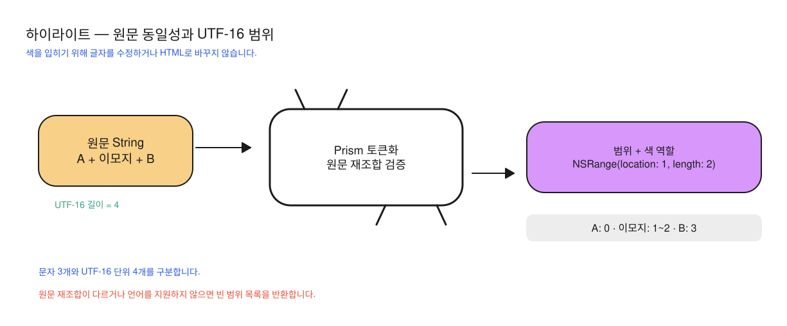

# ADR-0001: 코드 분석을 순서대로 실행하고 검증한 색 구간만 반환한다

- 기준일: 2026-10-06
- 상태: **소급 기록 — 현재 구현 확인**
- 범위: `RichMarkdownHighlight`의 토큰화와 `RichMarkdown`의 색 적용 경계

소급 기록은 기존 구현을 읽고 그 선택을 나중에 정리한 문서를 뜻합니다. 당시의 의사결정 과정이나 성능 비교를 확인한 기록은 아닙니다.

## 배경

코드 블록은 문법 분석이 끝나기 전에도 원문으로 표시할 수 있어야 합니다. Prism의 토큰화는 코드 원문을 키워드·문자열·주석 같은 조각으로 나누는 작업입니다. 분석 결과를 HTML 문자열로 전달하거나 글자 수로 위치를 계산하면 이모지 이후의 색 범위가 어긋나거나 표시 문자열이 바뀔 수 있습니다.

또한 여러 코드 블록이 하나의 JavaScript 실행 환경(context)을 공유하면, 그 상태를 누가 관리할지 정해야 합니다. 이 ADR(Architecture Decision Record, 아키텍처 결정 기록)은 실행 환경을 한 곳에서 관리하고 검사를 통과한 원문 구간(span)만 반환하는 현재 선택을 설명합니다.

현재 공개 확장점은 문자열 변환 대신 원문 위치와 종류를 담은 `RichMarkdownHighlightSpan(range:kind:)` 배열을 받습니다. 화면 표시와 코드 분석 엔진을 분리하되 원문 위치가 정확한지 검사하는 구조입니다.

## 현재 선택

`PrismHighlighter` actor가 JavaScript 실행 환경을 첫 요청에서 만들고 이후에 재사용합니다. actor는 공유 상태에 대한 접근을 보호하는 Swift 타입이며 전용 스레드 하나를 뜻하지는 않습니다. 사용자 코드는 실행할 스크립트에 이어 붙이지 않고 함수 인자로 전달합니다.

토큰 안의 자식 토큰을 원문 순서대로 펼쳐 조각 배열로 만든 뒤, UTF-16 범위 검사와 전체 원문 일치 검사를 통과한 색 구간만 반환합니다. 실패 시 오류 화면이나 부분 결과 대신 빈 배열 `[]`를 반환합니다.

UTF-16은 문자를 16비트 단위로 표현하는 방식이며 UIKit의 `NSRange`가 쓰는 위치 기준입니다. Swift `Character`로 센 글자 수나 UTF-8 바이트 수와 다르기 때문에, 조각의 위치는 반드시 원문과 같은 단위로 계산해야 합니다.

그림은 가상 예시 `A😀B`를 UTF-16 네 칸으로 나눈 것입니다. 이모지를 글자 하나로 세지 않고 가운데 두 단위로 세므로, 뒤 글자의 원문 시작 기준 위치(offset) 3을 보존합니다. 오른쪽의 검사는 조각을 모두 합친 문자열이 원문과 정확히 같은지 확인하는 단계입니다.

## 비교안과 비용

| 방식 | 얻는 것 | 비용·제약 | 현재 선택과의 관계 |
| --- | --- | --- | --- |
| actor + 색 구간 배열 | 실행 환경을 한 곳에서 관리하고 UIKit·SwiftUI가 같은 데이터를 사용합니다. 원문도 검사합니다. | 같은 인스턴스의 요청을 순서대로 처리하며 범위 검사가 필요합니다. | 현재 구현입니다. |
| WebView의 강조 HTML | 웹 스타일을 재사용합니다. | HTML 안전 처리, 화면 높이 측정, 웹 프로세스가 필요합니다. | 코드 색만 적용하는 역할보다 책임이 커집니다. |
| 요청마다 새 실행 환경 | 요청별 상태를 분리합니다. | 번들 문법을 반복해서 읽어야 합니다. | 현재는 실행 환경을 재사용하고 reset을 제공합니다. |
| 원문을 색 속성이 붙은 문자열로 직접 변환 | 결과를 받는 뷰의 처리가 줄어듭니다. | 플랫폼별 속성 문자열(attributed) 타입에 의존하며 원문 변경 여부를 따로 검사해야 합니다. | 현재는 테마와 표시를 결과를 사용하는 렌더러에 둡니다. |

표는 현재 코드를 읽고 설명한 비용입니다. WebView와 새 실행 환경 안의 실행 성능을 비교 측정하지 않았습니다.

## 효과와 한계

엔진은 실제 색 값을 알지 않고 키워드·문자열 등의 역할만 돌려줍니다. 사용하는 앱이 테마를 바꿔도 같은 색 구간에 다른 색을 적용할 수 있습니다. 연산자(operator)·구두 기호(punctuation)는 색을 주지 않아 일반 코드가 과도하게 강조되는 것을 피합니다.

actor는 동기 토큰화를 순서대로 실행합니다. 취소는 시작 전에만 확인하고 실행 중 문자열 패턴을 찾는 정규식을 중단하지 않습니다. 100,000 UTF-16 단위의 입력 상한은 실행 시간 보장과 다르며, 대응 제안은 [IH-01](../improvements/RichMarkdownHighlight.md#ih-01-코드-분석-시간과-실행-중-취소)에 분리했습니다.

`[]`는 실패 이유를 구분하지 않습니다. 또한 SwiftUI 소비 뷰의 기존 색 해제와 이전 요청 결과의 표시 방지는 엔진 밖의 책임입니다. 현재 소비 뷰에 반영한 수정은 [렌더러 개선 기록](../improvements/RichMarkdown.md#render-imp-02-swiftui-코드-색-결과의-요청-일치-확인)을 따르며, 이 ADR 자체는 모든 뷰의 늦은 결과 처리가 완성됐다는 선언이 아닙니다.

## 근거와 검증 상태

- [PrismHighlighter.swift](../../../Sources/RichMarkdownHighlight/PrismHighlighter.swift) — actor의 실행 환경 관리, 입력 제한, 함수 인자 전달, UTF-16 원문 비교
- [native-tokenize.js](../../../Sources/RichMarkdownHighlight/Resources/Prism/native-tokenize.js) — 자식 토큰부터 조각 배열로 펼치는 처리, 별칭 적용
- [RichMarkdownCodeBlockOptions.swift](../../../Sources/RichMarkdown/RichMarkdownCodeBlockOptions.swift) — 색 구간 계약과 원문 보존
- [PrismHighlighterTests.swift](../../../Tests/RichMarkdownHighlightTests/PrismHighlighterTests.swift) — 실제 문법·별칭·Unicode 문자, 실패 시 대체 동작·실행 환경 초기화 확인 코드

이번 문서 윤문에서는 테스트와 성능 측정을 새로 실행하지 않았습니다. 기존 실행 결과는 [검수 기록](../validation.md)을 따릅니다.
