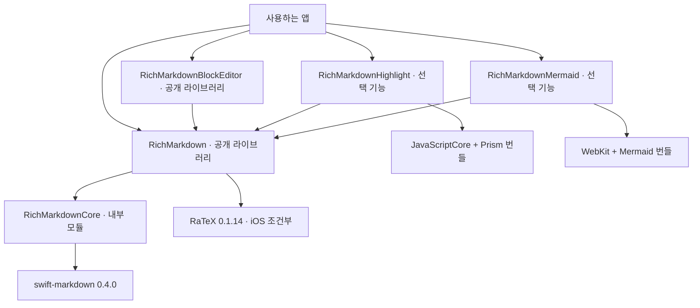
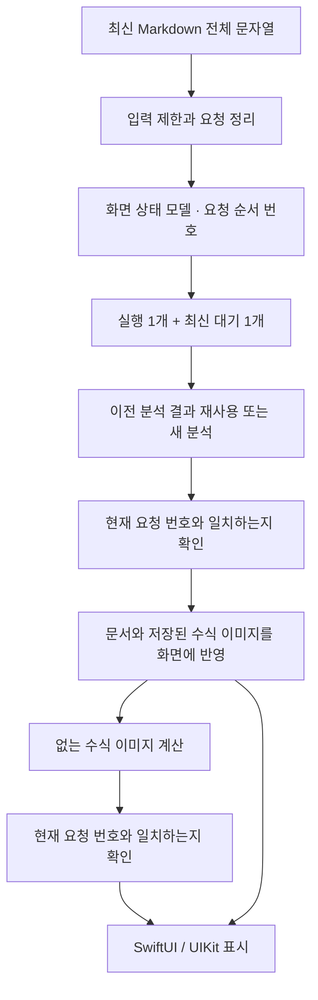

# RichMarkdown 전체 아키텍처

기준일: 2026-10-06 · 구현 기준: `0.9.0` 릴리스 대상 소스

앱은 입력이 바뀔 때마다 최신 Markdown 전체 문자열을 전달합니다. Core가 문자열을 문서 구조로 분석하면, 공통 표시 모델이 문서와 수식 이미지를 SwiftUI 또는 UIKit에 전달합니다. 이를 각각 파싱과 렌더링이라고 부릅니다.

블록 편집기, 코드 색칠, Mermaid는 앱이 별도 공개 라이브러리(product)로 선택합니다. 구성의 근거는 [Package.swift](../../../Package.swift)이며, 타깃·모델·비동기 요청의 뜻은 [용어 안내](../glossary.md)에서 확인할 수 있습니다.

## 모듈과 의존 방향

화살표는 **기능을 사용하는 모듈 → 그 기능을 제공하는 모듈**입니다. 앱은 사용하는 공개 라이브러리만 선택합니다.

Core는 Markdown 분석과 분석 결과를 담는 자료형을 담당합니다. 화면 모듈은 그 결과를 표시하고 수식의 크기·색을 적용합니다.

기본 표시 모듈이 코드 블록 확장의 인터페이스(protocol)를 정하고, 앱이 그 규칙을 따르는 코드 색칠·다이어그램 구현체를 전달합니다. 이 방식 덕분에 기본 표시 모듈은 Highlight나 Mermaid 구현을 직접 `import`하지 않습니다.

`RichMarkdown`은 `RichMarkdownCore`와 RaTeX에 의존하며, RaTeX 연결은 iOS 조건부입니다.
Foundation 기반 Core를 따로 빌드할 수 있어도 macOS 화면 라이브러리를 제공한다는 뜻은 아닙니다.

## 입력부터 화면까지

[RichMarkdownRenderModel.swift](../../../Sources/RichMarkdown/RichMarkdownRenderModel.swift)는 같은 문서를 분석하는 요청인지 판별하는 값과 수식 이미지의 색·크기 설정을 구분합니다. 글자가 뒤에 이어 붙는 스트리밍 요청은 이전 표시를 유지할 수 있습니다. 문서가 다른 내용으로 교체되면 이전 문서·이미지 조합은 현재 결과로 쓰지 않습니다.

[Core의 작업 처리기](../../../Sources/RichMarkdownCore/CoalescingWorker.swift)는 실행 중인 작업 하나와 가장 최근 대기 입력 하나만 보관합니다. 모든 중간 입력을 줄 세워 처리하는 대신 새 입력이 이전 대기 입력을 교체합니다.

화면에 반영하기 전에는 요청 순서 번호(`generation`)를 비교해 오래된 결과를 걸러냅니다. 이는 이미 시작한 계산을 즉시 중단하는 기능과는 다릅니다. 같은 수식 결과를 다시 쓸 수 있는 캐시도 요청이 바뀔 때 전부 지우지는 않습니다.

UIKit의 블록 수식은 선과 윤곽선으로 그리는 벡터 표시 경로도 사용합니다. 따라서 모든 수식 계산이 화면 처리와 분리된 작업에서만 실행된다고 가정하지 않습니다.

## 표시 표면과 확장 경계

| 경계 | 담당 | 상세 문서 |
| --- | --- | --- |
| 문자열 → 수식 구간 보호 → 구문 트리(AST) → 내부 문서 | Core | [Core 구조](RichMarkdownCore.md) |
| 문서·수식 이미지 → SwiftUI / UIKit | Renderer | [표시 모듈 구조](RichMarkdown.md) |
| 연속 편집 문자열·선택 범위 → 블록 → Markdown | BlockEditor | [편집기 구조](RichMarkdownBlockEditor.md) |
| 코드 원문 → UTF-16 범위와 색 역할 | Highlight | [코드 색칠 모듈 구조](RichMarkdownHighlight.md) |
| Mermaid 원문 → 앱 안의 웹 문서 구조(DOM)·그림 크기 | Mermaid | [Mermaid 구조](RichMarkdownMermaid.md) |

다이어그램 확장은 담당 언어의 코드 블록 본문을 대체합니다. 하이라이트는 원문을 유지하면서
색 범위만 추가합니다. 둘의 주입 계약은
[RichMarkdownCodeBlockOptions.swift](../../../Sources/RichMarkdown/RichMarkdownCodeBlockOptions.swift)에
있습니다. 원문 복사와 실패 시 원문 표시 규칙은 각 모듈 명세에서 확인합니다.

## 현재 구조를 설명할 때의 한계

기존 개발 문서의 완료·성능·코드 실행 비율(coverage)을 이번 확인 결과로 옮기지 않았습니다.
구조나 테스트 코드의 존재만으로 모든 입력의 안전성, 최저 OS에서의 동작, 최신 DOM 반영을
확정할 수 없습니다. 조사에서 확인한 입력 경계와 비동기 수명의 위험은
[개선안](../improvements/README.md)에 따로 기록했습니다.
