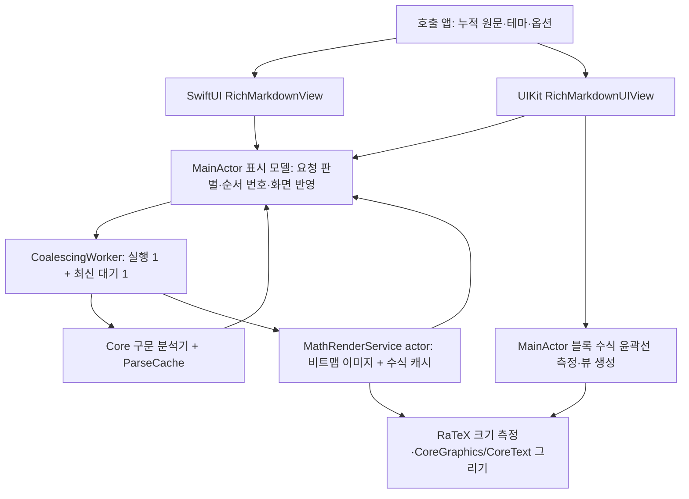
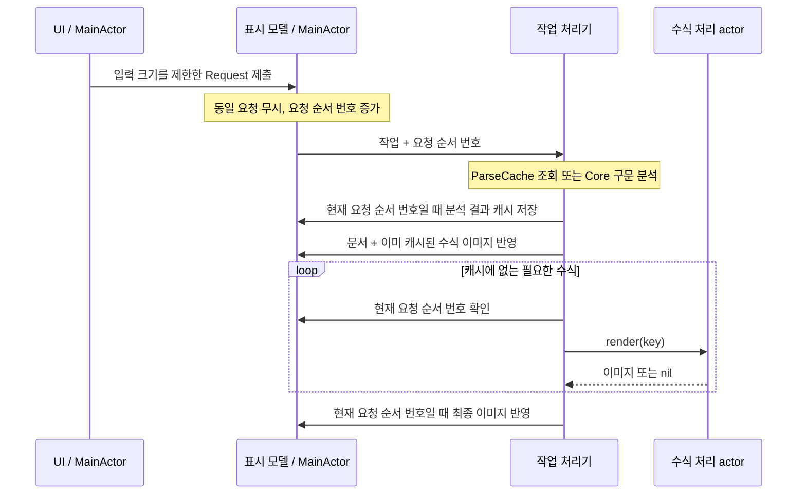

# RichMarkdown 아키텍처

기준일: 2026-10-06 · 현재 소스의 구조를 기록합니다.

`RichMarkdown`은 iOS에서 Markdown 문서와 LaTeX 수식을 표시하는 패키지 구성품(product)입니다. SwiftUI `RichMarkdownView`와 UIKit `RichMarkdownUIView`는 [RichMarkdownCore](RichMarkdownCore.md)의 구문 분석기(parser)와 같은 화면 표시 모델을 사용합니다. UIKit 렌더러는 SwiftUI 화면을 감싸서 띄우는 방식이 아니라 UIKit 뷰를 직접 구성합니다.

동작 계약은 [명세](../spec/RichMarkdown.md), 선택 근거는 [ADR](../adr/README.md#richmarkdown-adr), 반영한 변경은 [개선 기록](../improvements/RichMarkdown.md)에 있습니다. 실행 결과는 [검수 기록](../validation.md)을 따르며 기존 성능 수치를 이번 검증 결과로 옮기지 않습니다.

## 패키지 구성품과 공개 API

[Package.swift](../../../Package.swift)는 iOS 16을 최소 지원 버전으로 선언합니다. 별도의 macOS 12 선언은 Core 빌드 대상(target)에만 해당하며 UIKit UI의 macOS 지원을 뜻하지 않습니다. 수식 엔진 RaTeX는 iOS에서만 의존성으로 연결합니다.

JavaScriptCore·WebKit과 관련 번들은 앱이 해당 확장 구성품을 선택해 추가할 때만 사용합니다. 기본 표시 기능을 사용하기 위해 이 확장을 함께 추가할 필요는 없습니다.

| 공개 API | 맡는 일 | 소스 |
| --- | --- | --- |
| `RichMarkdownView` | SwiftUI에서 문단·코드·수식을 표시하고, 표시 결과가 없으면 원문을 보여 줍니다. SwiftUI 환경(environment)으로 전달한 옵션을 반영합니다. | [View](../../../Sources/RichMarkdown/RichMarkdownView.swift) |
| `RichMarkdownUIView` | UIKit 블록 뷰를 만들고 값이 같은 뷰를 재사용합니다. 크기가 바뀌면 콜백으로 앱에 알립니다. | [UIView](../../../Sources/RichMarkdown/RichMarkdownUIView.swift) |
| `RichMarkdownTheme`, `RichMarkdownFont` | 요소별 색·폰트·수식 정렬과 사용자의 글자 크기 설정(Dynamic Type)을 반영하는 기준을 제공합니다. | [Theme](../../../Sources/RichMarkdown/RichMarkdownTheme.swift), [Font](../../../Sources/RichMarkdown/RichMarkdownFont.swift) |
| `LatexDollarMathOptions` | `.single`·`.inlineDouble` 조합, 기존 Bool 호환 | [options](../../../Sources/RichMarkdown/LatexDollarMathOptions.swift) |
| `RichMarkdownStreamingOptions`, `RichMarkdownStreamingTextBuffer` | 조금씩 도착하는 원문의 끝부분 표시와 누적 원문을 화면에 전달하는 빈도를 조절합니다. | [streaming](../../../Sources/RichMarkdown/RichMarkdownStreamingOptions.swift) |
| `RichMarkdownCodeBlockOptions` 및 확장 프로토콜(protocol) | 코드 색을 지정하거나 다이어그램 뷰를 만드는 공급자를 앱에서 연결합니다. | [extension API](../../../Sources/RichMarkdown/RichMarkdownCodeBlockOptions.swift) |
| `LatexInlineMathScanner` | 본문 안의 수식 위치를 UTF-16 `NSRange`로 반환합니다. | [scanner](../../../Sources/RichMarkdown/LatexInlineMathScanner.swift) |
| `LatexEquationUIView`, `EquationTextAttachment` | Markdown 블록 UI 없이 수식 하나를 표시하거나 TextKit 2 문서 안에 수식 뷰를 삽입합니다. 이 삽입 요소를 텍스트 첨부 요소(attachment)라고 합니다. | [equation view](../../../Sources/RichMarkdown/LatexEquationUIView.swift), [attachment](../../../Sources/RichMarkdown/EquationTextAttachment.swift) |

UTF-16은 문자열을 16비트 단위로 세는 방식이며 `NSRange`의 위치와 길이도 이 단위를 사용합니다. 예를 들어 `😀`는 화면에서 한 글자처럼 보이지만 UTF-16에서는 두 단위이므로, 화면 글자 수로 수식 위치를 계산하면 어긋날 수 있습니다.

## 현재 요청 확인과 두 단계 화면 반영

[RichMarkdownRenderModel](../../../Sources/RichMarkdown/RichMarkdownRenderModel.swift)은 UI 상태를 메인 스레드에서 다루도록 하는 `@MainActor`에서 표시 상태를 관리합니다. UI가 입력을 받을 때 `InputLimits.bound`를 한 번 적용하고, 너무 큰 원문 전체 대신 크기를 제한한 문자열과 잘림 여부인 `wasTruncated`를 요청에 보관합니다.

`ParseIdentity`는 두 입력을 같은 구문 분석 요청으로 볼지 판단하는 기준입니다. 크기를 제한한 Markdown, 달러 수식 옵션, 잘림 상태를 비교합니다. 전체 `Request`에는 수식 폰트 크기, 실제 표시 환경에서 결정한 색 값(RGBA: 빨강·초록·파랑·투명도), 화면 배율, 블록 수식을 비트맵 이미지로 만들지 여부도 포함합니다.

여기서 비트맵 이미지(raster)는 픽셀로 만들어 둔 수식 그림입니다. 색·폰트만 바뀌면 구문 분석 결과는 같으므로 문서는 유지하고 기존 수식 이미지만 사용하지 않도록 처리할 수 있습니다.

수식 이미지가 모두 캐시에 있거나 만들 이미지가 없으면 문서와 이미지를 한 번 반영하고 끝냅니다. 일부 이미지만 준비되어 있으면 그 이미지를 문서와 함께 먼저 보여 주고, 나머지 수식은 원문 텍스트로 표시한 뒤 이미지가 완성되면 채웁니다. 이런 후속 채우기를 hydration이라고 하며, 모든 수식이 반드시 텍스트 표시 단계를 거치는 것은 아닙니다.

다른 문서로 교체하면 기존 문서·수식 사전을 지우고 크기를 제한한 최신 원문을 대신 보여 줍니다. 표시 결과가 없을 때 원문으로 대체하는 처리를 fallback이라고 합니다. 기존 `ParseIdentity`의 원문 전체가 새 원문의 앞부분과 같고, 달러 수식 옵션이 같으며, 두 원문 모두 잘리지 않았다면 새 분석 결과가 올 때까지 이전 표시를 유지합니다.

이 판단은 원문이 조금씩 도착하는 스트리밍 표시 옵션을 켰는지와 별개입니다. 이전 수식 이미지를 계속 사용하려면 비트맵 생성 설정도 같아야 합니다.

작업 처리기(worker)는 `nonisolated` 경로에서 구문 분석과 캐시 비용 계산을 수행하고, UI에 결과를 반영할 때 MainActor로 돌아옵니다. `generation`은 요청이 바뀔 때마다 증가하는 요청 순서 번호입니다. 수식 서비스 진입, 분석 이후, 각 수식 처리 전, 최종 반영 전과 반영 함수 안에서 이 번호가 현재 요청과 같은지 확인합니다.

예를 들어 이전 요청이 늦게 끝나더라도 순서 번호가 다르면 최신 화면을 덮어쓰지 못합니다. 다만 이미 진행 중인 동기 구문 분석이나 수식 이미지 생성을 즉시 중단하는 기능은 아닙니다. [ADR-0001](../adr/RichMarkdown-0001-render-identity-generation.md)에 선택 이유와 한계를 기록했습니다.

## 결과 종류별 캐시 정책

| 캐시 | 같은 결과를 찾는 기준(key) | 현재 제한·저장 조건 |
| --- | --- | --- |
| [ParseCache](../../../Sources/RichMarkdown/ParseCache.swift) | 달러 옵션의 원시 값 + 잘림 여부 + 크기를 제한한 Markdown | `NSCache`의 개수 제한은 256, 비용 제한은 16 MiB입니다. 작업 처리기가 원문·상위 블록·수식 개수로 비용을 계산하며, 정수 범위를 넘으면 표현 가능한 최대 비용을 사용합니다. 최신 요청 순서 번호 확인과 삽입은 MainActor에서 중간 대기 없이 이어서 수행합니다. |
| [MathRenderService](../../../Sources/RichMarkdown/MathRenderService.swift) | LaTeX + 폰트 크기(point size) + 실제 RGBA 색 값 + 본문 내/독립 블록 여부 + 배율 | `NSCache`의 개수 제한은 256, 비용 제한은 64 MiB입니다. 이미지의 실제 바이트 수를 비용으로 사용하며 메모리 부족 경고가 오면 제거합니다. |

구문 분석 캐시도 메모리 부족 경고가 오면 제거합니다. 표시 중인 원문 뒤에 텍스트를 덧붙이는 경우(prefix append)는 분석 결과를 새 캐시 항목으로 저장하지 않고, 문서 교체나 첫 제출일 때 저장합니다. 매 갱신 시점의 누적 원문을 오래 보관하는 일을 줄이는 규칙이며, 누적 원문 전체를 다시 분석하는 방식은 유지합니다.

수식 캐시는 문서의 요청 순서 번호 대신 재사용 가능한 수식 조건을 기준으로 합니다. 이미 시작한 이전 요청의 이미지 생성이 새 요청 이후에 끝나면 결과가 캐시에 들어갈 수 있습니다. 그 결과가 현재 화면에 잘못 반영되는 일은 모델의 요청 순서 번호 검사로 막습니다.

따라서 **과거 요청의 모든 캐시 저장을 금지한다**고 설명해서는 안 됩니다. `NSCache`의 제한 값은 항목을 제거하는 판단 기준이며, 실제 메모리 사용량의 엄격한 상한을 뜻하지 않습니다.

## 수식 표시 방식과 실패 시 원문 표시

| 표면 | 수식 표현 | 실패·미준비 표현 |
| --- | --- | --- |
| SwiftUI 본문 안 수식(inline) | 비트맵 이미지 `Text`, 글자 기준선에 맞추는 `-descent` 보정 | 구분자 포함 `source` 텍스트 |
| SwiftUI 독립 블록 수식(block) | 비트맵 이미지, 가로 스크롤·정렬·원문 복사 | 구분자 포함 `source`, 가로 스크롤·원문 복사 |
| UIKit 본문 안 수식 | 비트맵 `MathTextAttachment`, 실제 배치 계산에서 `-descent` 보정 | 구분자 포함 `source` 텍스트 |
| UIKit 독립 블록 수식 | MainActor에서 동기로 윤곽선 그림의 크기를 측정하고 UIKit 뷰를 생성, 가로 스크롤·정렬·원문 복사 | 구분자 포함 `source` 텍스트 |
| 단일 수식·TextKit 2 첨부 요소 | `LatexEquationUIView`의 윤곽선 그림 | 전달받은 `source` 또는 LaTeX 텍스트 |

윤곽선 그림(vector)은 고정 픽셀 이미지 대신 선과 글자 모양을 직접 그리는 표현입니다. 글자 기준선(baseline)은 글자를 나란히 놓는 수평 기준이며, `descent`는 그 선 아래로 내려가는 높이입니다. 본문 안 수식은 `-descent`만큼 위치를 보정해 주변 글자와 맞춥니다.

UIKit 요청은 `rastersDisplayMath = false`로 독립 블록 수식의 불필요한 비트맵 생성을 생략합니다. 블록 수식을 윤곽선으로 그리기 위한 LaTeX 분석·크기 측정·뷰 생성은 MainActor에서 동기로 수행합니다. 수식 계산 전체가 작업 처리기에서 실행된다고 설명해서는 안 됩니다.

수식 서비스와 윤곽선 표현은 계산 전에 같은 사전 검사(preflight)를 수행합니다. LaTeX는 UTF-8 기준 4,096바이트, 폰트 크기는 1…256, 배율은 1…4, 중괄호 중첩 깊이는 64로 제한하고 괄호 짝이 맞는지도 확인합니다. 배치 결과의 실측 크기는 각 변 8,192픽셀 이하·전체 4,194,304픽셀 이하로 제한합니다.

중괄호 검사만으로 TeX의 모든 구조 깊이를 검증했다고 볼 수 없습니다. 필요한 서체가 없거나 그리기 명령 목록(display-list)에 지원하지 않는 명령이 있어도 실패로 처리합니다. [ADR-0002](../adr/RichMarkdown-0002-math-surfaces-source-fallback.md)를 참고하세요.

`EquationTextAttachment`는 TextKit 2 문서에 삽입할 수식 뷰를 만들며 독립 블록 배치와 본문 안 글자 기준선을 구분합니다. 본문 안에서는 첨부 요소를 나타내는 문자에도 주변 `.font` 속성이 필요합니다. 공급자 콜백은 현재 `MainActor.assumeIsolated`로 UIKit 뷰를 만드므로, 임의의 작업 실행 문맥(executor)에서 직접 호출하는 API가 아닙니다.

첨부 요소의 생성자는 원문 크기를 제한하지 않고 저장합니다. 크기 제한은 실제 `LatexEquationUIView`를 생성할 때 적용됩니다.

## UI 재사용과 OS 분기

UIKit은 블록 값, 이미지로 채운 본문 내 수식 개수, 끝부분 표시 옵션, 글자·색 등 외형을 비교해 앞부분 뷰를 유지합니다. 스트리밍 표시가 켜진 상태에서는 구조가 같은 문단·제목·코드·표·인용·목록을 기존 뷰에서 갱신합니다. 구조·언어·표의 행/열·목록 항목 수가 달라지면 해당 방식으로 재사용하지 않고 새 뷰를 만듭니다.

중간 삽입 후에도 블록을 추적하는 영속 ID나, 가장 긴 공통 부분 수열(LCS)을 찾아 변경 부분만 계산하는 편집 비교 기능은 제공하지 않습니다.

표는 셀 내용에 필요한 열 폭을 96…240pt로 제한한 뒤, 그 폭을 `UITextView.sizeThatFits`에 전달해 각 셀의 필요한 높이를 구합니다. 행마다 가장 높은 셀을 기준으로 전체 높이를 합해 가로 스크롤 콘텐츠에 적용합니다. 이미 고정한 콘텐츠 높이를 Auto Layout의 크기 측정에 다시 넣지 않으므로 초기 임시 높이(placeholder)나 이전 높이에 갇히지 않습니다.

생성과 스트리밍 갱신은 같은 측정 경로를 사용합니다. [RENDER-IMP-03](../improvements/RichMarkdown.md#render-imp-03-uikit-표의-실제-셀-높이-측정)에 발견·수정 근거를 기록했습니다.

`objectWillChange`에 따른 뷰 재구성과 `onContentSizeChange` 콜백은 MainActor의 다음 처리 시점에 모아서 실행합니다. UIKit 뷰를 처음 만들 때는 크기를 제한한 원문을 즉시 표시합니다. 셀 안에서 이 뷰를 사용하는 앱은 콜백이 오면 셀 높이를 다시 측정하도록 연결해야 합니다.

| OS 조건 | 현재 처리 | 지원 조건 아래 경로 |
| --- | --- | --- |
| iOS 17 이상 | UIKit `registerForTraitChanges`로 Dynamic Type·색·scale 반영 | iOS 16은 `traitCollectionDidChange` |
| iOS 18 이상, SwiftUI 문단에 본문 내 코드가 있음 | `TextRenderer`로 둥근 코드 배경 칩을 그림 | iOS 16·17은 사각 배경 |
| 위 SwiftUI 둥근 코드 배경 경로 | 해당 문단에 텍스트 선택을 적용하지 않음 | 선택과 둥근 배경 모두 필요하면 UIKit 렌더러 사용 |

UIKit 일반 텍스트는 선택 가능하며 본문 내 코드의 배경 장식은 별도로 그립니다. 두 렌더러 모두 블록마다 텍스트 표시 영역이 나뉘므로, 전체 문서를 이어서 선택하거나 수식 이미지에서 LaTeX 텍스트를 선택하는 기능은 보장하지 않습니다. 블록 수식·코드는 원문 복사 버튼을 제공합니다.

## 스트리밍과 코드 확장

스트리밍 원문은 지금까지 받은 내용을 합친 전체 문자열입니다. `RichMarkdownStreamingTextBuffer`는 기본 100ms 간격 안에 들어온 대기 값(pending)을 최신 값 하나로 합치며, 간격이 끝날 때 한 번 더 전달하는 후속 반영(trailing)으로 마지막 갱신도 보냅니다. `flush`는 종료·오류 시 대기 값을 즉시 전달하고, `reset`은 이전 대기 값과 예약된 후속 반영을 버립니다.

버퍼 자체는 원문의 바이트 상한을 적용하지 않습니다.

스트리밍 표시 옵션은 구문 분석 요청을 바꾸지 않습니다. 문서의 마지막 하위 블록이 문단·제목일 때만 아직 닫히지 않은 시작 구분자(opener)를 숨기고, 사용자가 한 글자로 보는 단위(grapheme)를 점차 나타내는 효과를 적용합니다. 끝 블록이 코드·수식·표이면 이 텍스트 변환을 적용하지 않습니다.

코드 색을 지정하는 하이라이터(highlighter)는 원문의 UTF-16 범위와 7종 색 역할을 반환합니다. 두 UI 렌더러는 같은 분할 도우미(segment helper)를 사용하며, 음수·겹침·원문 밖 범위·정수 덧셈 초과(overflow)가 있는 범위(span)를 버립니다. 색을 지정하지 않은 사이 부분과 끝부분도 보존하므로 원문 자체는 바뀌지 않습니다.

SwiftUI는 코드·언어·하이라이터 객체 참조를 함께 비교해 같은 요청인지 판단합니다. 이 판별 기준을 작업 식별자(task id)와 결과 소속 확인에 함께 사용합니다. 화면의 `body`는 현재 요청과 같은 결과만 표시하고 새 요청은 이전 상태를 지우므로, 공급자 교체·제거·빈 응답 때 이전 색이 남지 않습니다.

`await`로 결과를 기다린 뒤에도 작업 취소 여부와 현재 요청의 결과인지 확인해야 화면에 반영할 수 있습니다.

다이어그램 공급자는 등록된 언어의 코드 본문을 뷰로 바꾸되, 코드 블록의 머리 영역(header)과 복사할 원문은 유지합니다. [RENDER-IMP-01·02](../improvements/RichMarkdown.md)는 범위 검사와 SwiftUI의 요청 판별 기준을 바꾼 근거·회귀 테스트를 기록합니다.

## 확인 근거

[RichMarkdownRenderModelTests](../../../Tests/RichMarkdownTests/RichMarkdownRenderModelTests.swift)는 최신 결과 반영, 문서 교체·원문 뒤 덧붙이기, 캐시 항목의 요청 소속, 블록 수식의 비트맵 생성 생략을 검사하도록 작성되어 있습니다. [RichMarkdownUIViewTests](../../../Tests/RichMarkdownTests/RichMarkdownUIViewTests.swift)는 처음 표시하는 대체 원문, 뷰 재사용, 윤곽선 수식 크기, 실패 시 원문 표시, 스트리밍·표·코드 배경 구성을 검사합니다.

[MathRenderServiceTests](../../../Tests/RichMarkdownTests/MathRenderServiceTests.swift)는 캐시 판별 기준과 사전 검사·배치 크기 초과 거절을 확인합니다. [ThemeFontTests](../../../Tests/RichMarkdownTests/ThemeFontTests.swift)와 [ThemeReachTests](../../../Tests/RichMarkdownTests/ThemeReachTests.swift)는 폰트·색의 실제 표시 경로를 검사합니다.

[CodeBlockHighlightIdentityTests](../../../Tests/RichMarkdownTests/CodeBlockHighlightIdentityTests.swift)는 실제 SwiftUI 화면을 띄워 언어·하이라이터 객체의 교체·제거와 늦게 도착한 결과를 검사합니다. 테스트 코드가 존재하는 것과 실행에서 통과한 것은 구분하며, 실제 실행 근거는 [검수 기록](../validation.md)에 있습니다. 특히 SwiftUI의 본문 내 코드 배경이 있는 문단의 선택, 블록 수식의 UI 처리 비용, 장문 스크롤·VoiceOver 동작은 정적 문서 검사만으로 승인할 수 없습니다.
