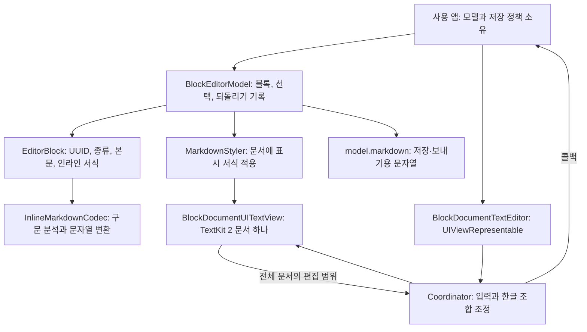
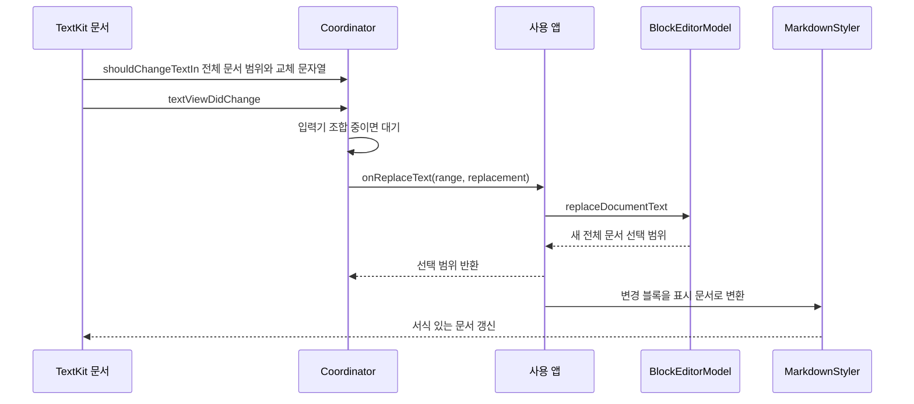

# RichMarkdownBlockEditor 아키텍처

기준일: 2026-10-06

상태: **구현·패키지 회귀 확인**. 최종 패키지·Demo 재검수와 배포 판정은 [릴리스 검수 기록](../validation.md)에서 구분합니다.

`RichMarkdownBlockEditor`는 문단·제목·코드처럼 종류를 가진 내용 단위를 논리 블록으로 보관합니다. 블록 데이터는 Swift 값 타입으로 관리하지만 화면에는 iOS 텍스트 배치 엔진인 TextKit 2의 문서 하나로 표시합니다. 블록 ID는 편집할 블록을 찾는 기준이고, 화면 선택은 전체 문서의 UTF-16 범위입니다.

UTF-16 범위는 화면 글자 수가 아니라 16비트 단위의 위치·길이입니다. 예를 들어 `😀`는 한 글자처럼 보여도 두 단위를 차지하므로 `NSRange`를 화면 글자 수로 계산하면 선택 위치가 어긋납니다. 저장·보내기에 사용할 Markdown은 모델의 블록 데이터를 문자열로 변환(직렬화)해 만들며, 편집 뷰에서 읽은 표시 문자열과 구분합니다.

관련 문서: [명세](../spec/RichMarkdownBlockEditor.md) · [ADR](../adr/README.md#richmarkdownblockeditor-adr) · [개선안](../improvements/RichMarkdownBlockEditor.md) · [재사용 후보 안내](../../DEMO_REUSE_CANDIDATES.md)

## 1. 모듈 경계

[Package.swift](../../../Package.swift)의 별도 패키지 구성품(product)인 `RichMarkdownBlockEditor`는 `RichMarkdown`에 의존합니다. 모델과 문자열 변환기인 코덱(codec) 파일은 Foundation만 불러오지만, 구성품 전체에는 UIKit·SwiftUI 편집기가 포함되므로 iOS 16 이상에서 사용합니다. 모델 파일이 UI에 의존하지 않는다는 사실이 구성품 전체의 다른 플랫폼 지원을 뜻하지는 않습니다.

앱이 `BlockEditorModel`을 소유합니다. 편집기는 블록과 선택 상태를 입력받고 변경 콜백을 보낼 뿐, 내부에 두 번째 모델을 만들지 않습니다. 도구 모음(toolbar)의 구체 UI와 명령 실행 연결, 파일 저장·서버 전송은 앱 책임입니다.

| 구성요소 | 책임 | 근거 |
| --- | --- | --- |
| `EditorBlock`, `InlineMark`, `BlockSelection` | 블록 ID, 본문과 서식, 블록 내부 UTF-16 좌표 | [EditorBlock.swift](../../../Sources/RichMarkdownBlockEditor/EditorBlock.swift) |
| `BlockEditorModel` | 전체 문서의 좌표 변환, 블록 분할·병합·변환·이동, 되돌리기(undo)·다시 실행(redo), Markdown 출력을 담당합니다. | [BlockEditorModel.swift](../../../Sources/RichMarkdownBlockEditor/BlockEditorModel.swift) |
| `BlockDocumentTextEditor.Coordinator` | TextKit 변경을 모델 콜백으로 바꾸고, 한글 등 입력기(IME)의 조합 확정·선택·스타일을 동기화합니다. | [BlockDocumentTextEditor.swift](../../../Sources/RichMarkdownBlockEditor/BlockDocumentTextEditor.swift) |
| `MarkdownStyler` | 본문과 별도로 저장한 서식을 속성 있는 문자열(attributed text)에 반영하고, 수식 선택 전환·테마·정렬을 적용합니다. | [MarkdownStyler.swift](../../../Sources/RichMarkdownBlockEditor/MarkdownStyler.swift) |
| 장식 뷰 | 인라인 코드 칩·인용 바·할 일 박스를 텍스트 뒤에 표시 | [QuoteBarDecorationView.swift](../../../Sources/RichMarkdownBlockEditor/QuoteBarDecorationView.swift), [ToDoCheckboxDecorationView.swift](../../../Sources/RichMarkdownBlockEditor/ToDoCheckboxDecorationView.swift) |

## 2. 블록 ID와 문서 좌표

블록 하나는 `UUID` ID, `EditorBlockKind`, `text`, `[InlineMark]`, `indentLevel`을 가집니다. `InlineMark`는 본문 일부에 적용할 굵게·기울임 같은 서식 범위입니다. ID는 텍스트와 종류가 바뀌어도 같은 블록을 찾는 기준입니다.

화면 문자열은 `blocks.map(\.text).joined(separator: "\n")`처럼 블록 본문을 줄바꿈으로 이어서 만듭니다. 블록 사이 구분 개행 하나도 전체 문서의 좌표에 포함합니다.

가상 예시에서 첫 블록이 `가😀`, 다음 코드 블록이 `let\nx`, 마지막이 빈 문단이면 문서 텍스트는 `가😀\nlet\nx\n`입니다. 첫 본문의 UTF-16 범위는 `(0, 3)`, 구분 개행의 시작 위치(offset)는 3, 코드 본문 범위는 `(4, 5)`입니다. 코드 안의 개행은 코드 블록 내부이며 위치 9의 개행이 다음 블록과의 경계입니다.

같은 예시는 [projectsBlocksIntoContinuousDocument](../../../Tests/RichMarkdownBlockEditorTests/BlockEditorModelTests.swift)에 있습니다.

| 작업 | ID 처리 |
| --- | --- |
| 텍스트 교체·종류 변환·들여쓰기·이동 | 대상 ID 유지 |
| 분할(split) | 왼쪽 ID 유지, 오른쪽은 새 UUID |
| 병합(merge) | 앞 블록 ID 유지, 뒤 블록 제거 |
| 복제(duplicate) | 내용·서식·들여쓰기 복제, 새 UUID |
| Markdown 재파싱 | 새로운 ID 발급 |
| 클립보드(pasteboard) 데이터 변환·복원 | ID는 복사할 실제 데이터(payload)에 저장하지 않으며 복원 시 새 UUID |
| `replaceDocumentBlocks` 직접 호출 | 전달된 블록 ID를 유지; 모델이 정규화하며 추가하는 블록은 새 UUID |

직접 `init(blocks:)`에 전달하는 ID의 중복은 검사하지 않습니다. 앱은 같은 문서에서 서로 구분되는 ID를 제공해야 합니다. 이 ID는 영구 저장용 문서 식별자나 공동 편집 버전을 나타내는 값이 아닙니다.

`currentDocumentSelection`은 여러 블록에 걸칠 수 있는 전체 문서의 선택 범위입니다. `currentSelection`은 선택이 시작하는 블록 안의 범위만 나타내며, 그 블록 끝을 넘는 부분은 잘립니다. 후자를 전체 선택의 저장소로 사용하면 여러 블록에 걸친 선택 길이를 잃으므로, 도구 모음에서 본문 일부에 서식을 적용할 범위를 정할 때 두 값을 구분해야 합니다.

## 3. 한 편집의 흐름

Coordinator는 텍스트 뷰의 입력을 전달받는 객체(delegate)가 준 실제 편집 범위를 우선 사용합니다. 한글 조합 중인 영역을 나타내는 `markedTextRange`가 있는 동안에는 모델 변경·문서 스타일 덮어쓰기·도구 모음 명령을 보류합니다. 조합 시작 범위를 기억했다가 입력이 확정되면 한 번 전달합니다.

편집 범위를 받지 못한 외부 변경에서만 이전·새 문자열의 공통 앞부분(prefix)과 뒷부분(suffix)을 비교해 바뀐 범위를 찾습니다. 이 대체 경로(fallback)는 문자열 길이에 비례하는 O(n) 비용으로 전체 문자열을 살핍니다.

일반 블록의 Enter는 새 논리 블록을 만듭니다. 목록·할 일은 다음 블록도 같은 종류로 이어지고 제목·인용 등은 다음 문단이 됩니다. 코드·수식 내부 개행은 `replaceDocumentText`와 `insertSoftBreak` 경로에서 같은 블록에 남습니다.

블록 시작에서 Backspace를 누르면 먼저 서식 종류를 문단으로 바꾸고, 문단이면 앞 블록과 합칩니다. 앞 블록이 코드·수식일 때는 합치지 않고 선택을 앞 블록 끝으로 옮깁니다.

## 4. 데이터 정리와 되돌리기 기록

정규화는 입력 데이터를 편집기가 다룰 수 있는 일정한 형태로 정리하는 처리입니다. 일반 블록의 `text`에 개행이 들어오면 여러 블록으로 나누되 코드·수식은 그대로 둡니다. 문서가 비어 있으면 빈 문단 하나를 만듭니다.

마지막 블록이 빈 문단이 아니면 끝에 빈 문단을 추가해 계속 입력할 위치를 남깁니다. 이동 명령은 이 마지막 빈 문단을 콘텐츠 이동 대상에서 제외합니다.

`apply`는 블록이 실제로 바뀔 때 이전 블록과 전체 문서 선택을 되돌리기 기록에 넣습니다. 기록 상한은 100개이며 새 편집을 시작하면 다시 실행할 기록을 지웁니다. 되돌리기·다시 실행은 문서와 선택을 함께 복원합니다.

이전 상태를 보관한 스냅샷(snapshot)은 현재 편집 세션의 메모리 데이터입니다. 디스크 저장이나 협업 기록 기능은 없습니다.

`EditorBlock` 생성과 공개 프로퍼티 대입은 `indentLevel`을 0...3, 제목(heading) 레벨을 1...3으로 제한합니다. 모델의 종류 변환·복제·들여쓰기와 클립보드 데이터 복원도 이 검사를 거치므로, Markdown 출력과 스타일러가 사용하는 숫자 범위가 같습니다. API의 프로퍼티 설정 권한(setter 접근 범위)과 블록 ID·`text`는 유지합니다.

적용 내용은 [IE-01](../improvements/RichMarkdownBlockEditor.md#ie-01-직접-블록-생성의-들여쓰기-범위)에 기록했습니다.

인라인 서식 범위를 생성하거나 직접 대입하면 기존 코덱의 정규화를 거칩니다. 범위는 `location >= 0`, `length >= 0`, `location <= count`, `length <= count - location`을 확인한 뒤 끝 위치를 계산합니다. 위치와 길이를 먼저 더했을 때 정수의 표현 범위를 넘는 오버플로가 생길 수 있으므로, 덧셈 결과에 의존하지 않고 잘못된 값을 제거하는 방식입니다.

모델은 유효하지 않은 편집 범위를 거절하고 스타일러는 잘못된 선택을 무시합니다. 입력 뷰는 끝 위치를 계산하기 전에 선택을 표시 문서 범위 안으로 제한(clamp)합니다. 입력기 조합으로 교체할 문자열도 같은 내부 범위 검사를 사용하며, 적용 범위는 [IE-03](../improvements/RichMarkdownBlockEditor.md#ie-03-공개-utf-16-범위의-합계-검사)에 기록했습니다.

## 5. 수식 표시와 선택 위치 보존

본문 서식은 `**` 같은 구분자(delimiter)를 표시 문자열에서 제거한 `text + inlineMarks`로 관리합니다. `MarkdownStyler`는 본문 일부의 굵게(bold)·기울임(italic)·취소선·코드 서식을 문자열 속성(attribute)으로 반영합니다. 코드·수식 블록에는 인라인 Markdown 서식을 적용하지 않습니다.

선택하지 않은 수식은 `EquationTextAttachment` 한 단위와 눈에 보이지 않는 `U+2063` 보충 문자열로 표시합니다. 이 조합의 UTF-16 길이를 원문 길이와 같게 만들어 뒤 블록의 위치를 유지합니다. 선택이 수식과 겹치면 수식 그림을 원문으로 바꿉니다.

UTF-16에서 이모지 등을 두 단위로 나타내는 짝을 surrogate라고 합니다. 원문으로 전환할 때 커서(caret)가 이 짝의 중간에 있으면 유효한 문자 경계로 맞춥니다. **길이 보존과 문자열 동일성은 다르므로**, 첨부 요소·보충 문자가 들어갈 수 있는 `UITextView.text`를 저장 원문으로 사용하면 안 됩니다.

본문 안의 `\(...\)`는 기본 수식 입력이고 `$...$`는 `parsesDollarMath`로 켭니다. 코드 서식 안, 문법 문자로 해석하지 않도록 처리한 표현(escape), 통화로 판정한 표현은 수식에서 제외합니다. 표시·수식 위치 탐색·첨부 뷰는 `RichMarkdown`의 기존 기능을 재사용합니다.

## 6. 편집에서 저장·보내기까지

현재 패키지에는 `send` API나 전송 완료 상태가 없습니다. 앱이 전송 기능을 붙일 때는 다음 데이터 구분을 지켜야 합니다.

1. 입력 콜백이 `BlockEditorModel`에 반영된 뒤 모델이 편집 상태의 기준입니다.
2. 앱은 `model.markdown`을 저장·보내기 문자열로 사용합니다. `documentText`에는 블록 마커가 없고 편집 뷰의 표시 문자열에는 수식 대체 문자가 있을 수 있습니다.
3. 전송 성공·실패, 재시도, 편집 문서 유지·초기화는 앱 정책입니다. 모델의 `.done`이나 키보드 닫기를 전송 완료로 해석하지 않습니다.

실제 주입 예시는 [BlockEditorDemo.swift](../../../Examples/RichMarkdownDemo/Sources/BlockEditorDemo.swift)입니다. 이 데모는 `sourceMarkdown: model.markdown`으로 전체 선택 복사 원문을 전달하며 서버 전송은 구현하지 않습니다.

Markdown 출력은 지원하는 서식을 패키지가 정한 일관된 표기(canonical)로 정리합니다. 기울임은 `<em>`, 목록 기호(bullet)는 `-`로 출력하며 연속 번호는 다시 계산합니다. 공백·빈 줄·마커 표기와 UUID가 원본과 동일하다고 보장하지 않습니다.

원문을 그대로 보존하는 편집기나 CommonMark의 전체 구문 트리(AST)를 편집하는 기능은 아닙니다. 블록을 Markdown으로 저장한 뒤 다시 블록으로 읽는 재변환(roundtrip)의 지원 범위는 [명세](../spec/RichMarkdownBlockEditor.md#4-markdown과-복사붙여넣기-계약)에 있습니다.

일반 문단의 제목·목록·인용 시작 기호에는 문법으로 읽히지 않도록 역슬래시를 넣고, 인라인 코덱이 읽을 때 이를 원문으로 복원합니다. 번호 마커는 `1\. 본문`처럼 점을 처리합니다. 코드 블록을 여닫는 구분기호(fence)는 최소 역따옴표(backtick) 3개이며 본문 안에서 가장 길게 이어진 역따옴표보다 길게 만듭니다.

`EditorBlock`과 문서를 블록으로 나누는 처리기는 같은 구분기호 길이·종료 규칙을 사용합니다. 따라서 더 짧은 구분기호나 구분기호 뒤에 다른 문자열(suffix)이 붙은 본문 줄은 코드 블록을 닫지 않습니다.

일반 문단(paragraph)의 인라인 서식을 출력한 결과가 `\[`로 시작하고 `\]`로 끝나면 양끝 역슬래시(backslash)를 한 번 더 표시합니다. 다시 읽을 때 수식(equation) 블록으로 바뀌지 않고 문자 그대로(literal)인 문단을 유지하기 위한 처리입니다. 인라인 코덱이 이 처리를 해제하면 원문 `text`와 서식 범위가 돌아오며, 실제 `.equation` 종류에는 이 문단 전용 규칙을 적용하지 않습니다.

Markdown은 중간 빈 문단 개수와 목록 이외 블록의 `indentLevel`까지 보존하는 저장 형식(schema)이 아닙니다. 이런 구조가 필요한 전체 문서 내부 복사에는 실제 블록 데이터를 담은 payload를 사용합니다. 코드 언어(language)는 개행·역따옴표와 앞뒤 공백이 없는 단일행 표기만 재변환 지원 범위에 포함합니다.

## 7. 장식·접근성·수명

인용 바와 할 일 박스는 종류를 나타내는 문자열 속성을 읽고, TextKit 2가 계산한 텍스트 영역(text segment) 뒤에 그립니다. 장식 뷰는 `isUserInteractionEnabled = false`이므로 할 일 박스를 눌러 상태를 바꾸는 버튼이 아닙니다. 상태 변경은 앱의 종류 변환 명령으로 연결하며, 본문 내 코드의 배경 칩은 `RichMarkdown`의 장식을 재사용합니다.

텍스트 뷰는 문서 내용을 보관하는 content storage를 소유하고, 장식 뷰는 텍스트 뷰를 약하게 참조합니다. 문자열 속성만 바뀌어도 장식을 다시 그리도록 명시적으로 알립니다. 편집기는 사용자의 글자 크기 설정(Dynamic Type)과 `문서 편집기` 접근성 이름(label)을 사용하며, 입력기 조합 중 도구 모음 사용을 요청하면 안내를 읽습니다.

이 기능들이 있다는 사실을 음성 읽기·체크 상태 조작·긴 문서 성능까지 전체 검증했다는 뜻으로 해석하지 않습니다.

새 UI API가 모든 지원 버전에서 동작한다고 가정하지 않습니다. 화면 환경(trait) 변경을 감지하는 장식 등록은 iOS 17 이상에서 사용하고, iOS 16은 `traitCollectionDidChange`로 대신 처리합니다.

## 8. 근거와 실행 한계

[BlockEditorModelTests.swift](../../../Tests/RichMarkdownBlockEditorTests/BlockEditorModelTests.swift)는 모델 상태 변화·Unicode·되돌리기 기록·화면 문자열 변환·수식·입력기·테마와 실제 TextKit 첨부 요소를 확인하는 코드를 포함합니다. 숫자 경계, 문자 그대로인 문단, 코드 구분기호에서 기존 구현이 실패함을 확인한 뒤 수정했습니다. 공개 범위 검사와 블록 수식 모양 문단의 회귀 테스트도 추가했습니다.

수정 후 전체 패키지 테스트는 exit 0, 실패 테스트 0, 오류 0으로 완료되었습니다.

이후 번들 의존성 보안 변경을 포함한 최종 패키지·Demo 재검수와 배포 판정은 [릴리스 검수 기록](../validation.md)에서 구분합니다. 실제 클립보드 데이터의 크기·버전 변조, 음성 읽기와 긴 문서 처리 비용은 별도 확인이 필요합니다.
