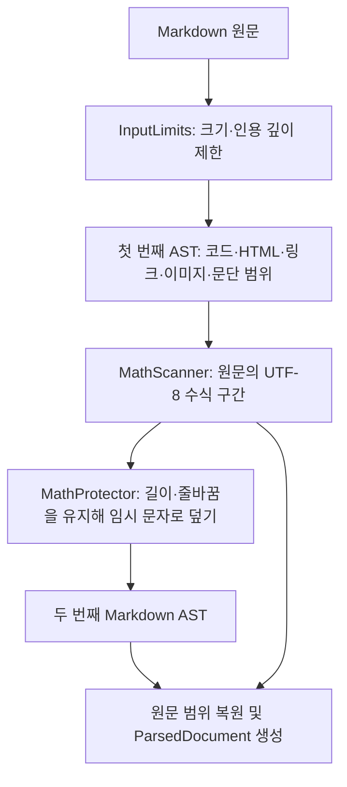
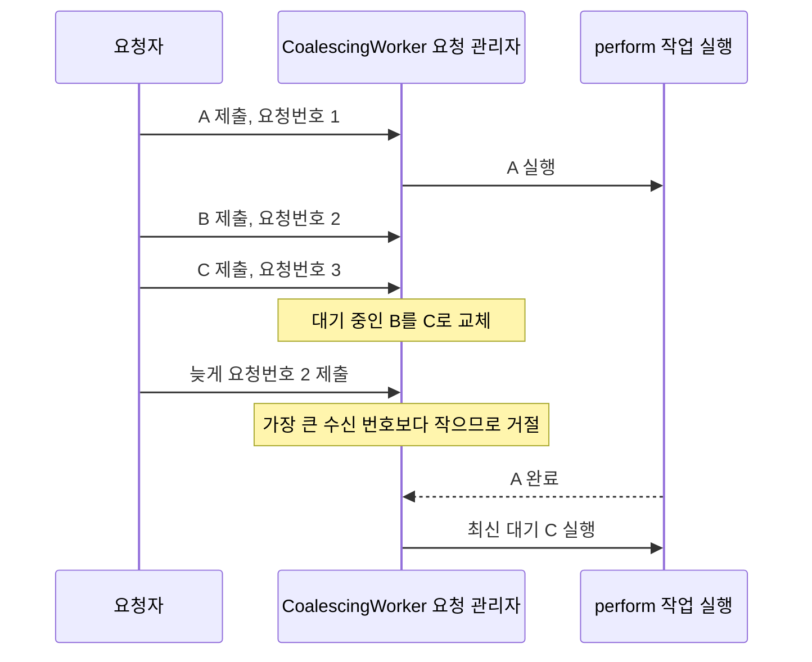

# RichMarkdownCore 아키텍처

기준일: 2026-10-06 · 현재 소스의 구조를 기록합니다.

`RichMarkdownCore`는 Markdown 원문을 분석해, 화면을 그리는 코드가 사용할 문단·코드·수식 등의 데이터로 바꾸는 내부 모듈입니다. SwiftPM의 `target`은 함께 컴파일하는 코드 단위이고, `product`는 앱이나 다른 패키지에 공개하는 사용 단위입니다. Core는 별도 공개 product가 아니며 UIKit·SwiftUI·수식 엔진의 뷰나 이미지를 만들지 않습니다.

[Package.swift](../../../Package.swift)에서 Core의 의존성은 Markdown 문법을 분석하는 `Markdown` 라이브러리이며, [RichMarkdown](RichMarkdown.md)이 Core의 결과를 사용합니다. 이 문서에서 파싱은 원문을 읽어 문서 구조로 바꾸는 작업, 렌더링은 그 결과를 화면에 표시하는 작업을 뜻합니다.

동작 계약은 [명세](../spec/RichMarkdownCore.md), 선택 근거는 [ADR](../adr/README.md#richmarkdowncore-adr), 반영한 변경은 [개선 기록](../improvements/RichMarkdownCore.md)에 나눠 기록했습니다. 실행 결과는 [검수 기록](../validation.md)을 따릅니다.

## 책임과 경계

| 구성요소 | 맡는 일 | 맡지 않는 일 |
| --- | --- | --- |
| [InputLimits](../../../Sources/RichMarkdownCore/InputLimits.swift) | 문서 전체 분석과 수식 구간 검색 전에 원문 크기·인용 중첩 깊이를 검사 | 수식 구조·수식 이미지 크기 검증 |
| [RichMarkdownParser](../../../Sources/RichMarkdownCore/DocumentBuilder.swift) | Markdown 문맥 수집, 수식 보호, 분석 결과의 내부 모델 변환 | 외부용 문서 구조 제공, 문서 편집·저장 |
| [MathScanner](../../../Sources/RichMarkdownCore/MathScanner.swift) | 원문에서 수식의 시작·끝 구분자와 주변 문맥 확인 | 수식 표기인 LaTeX를 실제로 그릴 수 있는지 판정 |
| [MathProtector](../../../Sources/RichMarkdownCore/MathProtector.swift) | 수식 부분을 임시 문자로 덮되 원문의 바이트 길이와 줄바꿈 유지 | 화면용 수식 이미지 생성 |
| [ParsedDocument](../../../Sources/RichMarkdownCore/ParsedDocument.swift) | 문서 블록·문장 안의 조각·수식 원문·진단 전달 | UI 상태, 저장 후에도 유지되는 블록 ID |
| [CoalescingWorker](../../../Sources/RichMarkdownCore/CoalescingWorker.swift) | 실행 중 1건과 최신 대기 1건 유지 | 요청 취소, 결과를 화면에 반영할지 결정 |
| [StreamingTail](../../../Sources/RichMarkdownCore/StreamingTail.swift) | 스트리밍 끝부분의 미완성 수식 시작 기호 숨김·글자별 투명도 계산 | 원문·파싱 결과 변경 |

모델과 파싱 API는 같은 패키지 안에서만 접근하는 `package` 수준입니다. 다른 SwiftPM 패키지가 `RichMarkdownCore`를 직접 사용해 문서 구조를 얻는 공개 계약은 제공하지 않습니다.

## 수식을 보호하는 두 단계 파싱

단순화한 예 `\(x_[i] + a * b\)`를 일반 Markdown 파싱 결과에서만 찾으면 `_`, `[]`, `*` 때문에 수식이 여러 부분으로 나뉠 수 있습니다. AST(추상 구문 트리)는 파싱 결과를 문단·링크·코드 등의 노드로 구성한 문서 구조입니다. 첫 번째 AST에서는 수식 내용 대신 주변 Markdown 문맥을 확인하고, 수식 자체는 원문에서 찾습니다.

UTF-8은 문자를 바이트로 저장하는 방식이며, 아래 수식 검색은 원문 위치를 이 바이트 단위로 기록합니다. 글자 수와 바이트 수의 차이는 뒤의 위치 단위 절에서 예로 설명합니다.

1. `InputLimits.bound`가 제한을 초과한 입력을 표시 가능한 길이로 줄입니다. 사용할 문자열과 잘림 여부인 `wasTruncated`를 함께 보존합니다.
2. 첫 번째 `Document(parsing:)`에서 코드·HTML·링크·이미지·문단의 원문 범위를 모읍니다. 코드와 HTML은 내부 기호를 수식으로 읽으면 안 되는 제외 구간인 hard barrier로 취급합니다. 링크와 이미지는 수식 내용이 그 범위를 완전히 감싼 경우에만 수식으로 읽을 수 있는 조건부 제외 구간인 soft range로 취급합니다.
3. `MathScanner`가 원문 UTF-8 배열에서 수식 구간(span)을 찾습니다. 코드·HTML 제외 구간 안이나 이를 가로지르는 수식은 허용하지 않습니다. 한 문단을 수식이 통째로 차지하는지도 확인해, 문장 안 수식과 별도 블록 수식을 나눕니다.
4. 수식 구간의 CR·LF를 제외한 바이트를 1바이트 ASCII `x`로 바꿉니다. 이렇게 수식을 임시 문자로 덮는 작업을 마스킹(mask)이라고 합니다. 수식 안에 한글이 있어도 원문과 보호용 배열인 버퍼의 UTF-8 길이는 같습니다.
5. 보호 버퍼를 다시 파싱하고 두 번째 AST의 범위를 원문에 적용합니다. 수식 부분은 `MathSegment`로, 나머지는 문장 안의 조각(run)으로 변환합니다. 일반 텍스트의 `&amp;` 같은 HTML 문자 표기(entity)와 `\*` 같은 기호 이스케이프(escape)는 Markdown 규칙에 맞게 해석합니다.

수식 옆 HTML 문자 표기를 다시 해석할 때는 수식을 임시 표시자로 바꿔 두어야 합니다. 이 표시자에는 Unicode의 사용자 정의 영역 문자(private-use scalar)를 사용하며, 원문과 문자 표기 해석 결과 양쪽에 없는 문자를 골라 충돌을 피합니다. 일반 텍스트에 수식이 없고 구분자 이스케이프도 없으면 두 번째 AST의 `Text.string`을 재사용합니다.

세부 선택은 [ADR-0001](../adr/RichMarkdownCore-0001-two-pass-math-protection.md)에 있습니다.

## 위치 단위

Core 수식 구간의 `originalUTF8Range`와 진단의 `utf8Range`는 **0부터 시작하는 UTF-8 바이트 반열린 범위**입니다. 반열린 범위는 시작을 포함하고 끝을 제외한다는 뜻으로, `1..<4`는 바이트 위치 1·2·3을 포함합니다. `ProtectedMathSpan.source`에는 구분자가 남고, `latex`에서만 구분자와 바깥 공백을 제거합니다.

UTF-8은 문자를 바이트로 저장하는 방식이고 UTF-16은 16비트 단위로 저장하는 방식입니다. Swift의 `Character`는 결합 문자나 이모지 조합을 하나로 묶은 글자 단위이며 `String.count`는 이 단위를 셉니다. 단순화한 예 `A😀B`는 UTF-8 6바이트, UTF-16 4단위, `Character` 3개이므로 서로의 위치 값을 그대로 바꿔 쓸 수 없으며 화면에 그려지는 글리프 수와도 같다고 가정하지 않습니다.

[UTF8LineMap](../../../Sources/RichMarkdownCore/UTF8LineMap.swift)은 Markdown의 1부터 시작하는 행 번호와 UTF-8 바이트 열 번호를, 원문 처음부터 센 바이트 위치(offset)로 변환합니다. 줄바꿈 형식인 CR·LF·CRLF를 각각 한 행의 끝으로 처리하며, 두 바이트로 이루어진 CRLF도 한 번만 셉니다. 원문 바이트는 바꾸지 않고 열 번호를 더하기 전에 원문 길이를 확인합니다.

[CORE-IMP-01](../improvements/RichMarkdownCore.md#core-imp-01-단독-cr-줄바꿈-뒤의-위치-변환-기준)은 의존 라이브러리의 `SourceLocation`과 위치 기준을 맞춘 근거를 기록합니다.

UIKit의 공개 편집 API에서 범위가 필요한 경우 [LatexInlineMathScanner](../../../Sources/RichMarkdown/LatexInlineMathScanner.swift)가 Core 결과를 UTF-16 `NSRange`로 바꿉니다. Core 범위를 `NSRange`로 그대로 사용해서는 안 됩니다.

## 제한과 실패 표현

문서 전체를 분석하는 경로(full parse)는 262,144 UTF-8 바이트를 초과하면 첫 65,536바이트 안에서 `Character`를 쪼개지 않는 위치까지 남기고 빈 줄과 `… [입력 제한 초과]`를 붙입니다. 인용의 중첩 깊이가 64를 초과하면 해당 행 앞에서 잘라 같은 생략 표시를 붙입니다. 백틱이나 물결표로 감싼 코드 블록(fence) 내부의 `>`는 코드 문자로 취급하고, CR·LF·CRLF 줄바꿈을 처리합니다.

표는 AST 변환 단계에서 최대 32열·512셀을 검사합니다. 초과한 표는 해당 블록 원문을 일반 문단으로 표시하며 문서 전체의 `wasTruncated`를 새로 켜지는 않습니다. 이미지는 대체 텍스트(alt text)로, HTML은 실행하지 않는 텍스트로, 허용하지 않는 링크는 링크 이름만 표시합니다.

`maxMathSourceUTF8Bytes = 4,096`은 UI 수식 엔진에 전달하기 전 검사에 사용됩니다. `MathScanner` 자체는 이 크기로 수식 구간을 거절하지 않으며 `oversizedMathSource` 진단 종류도 현재 생성하지 않습니다. 원문에서 수식을 찾는 일과 수식을 실제로 그리도록 허용하는 일은 구분해야 합니다.

`scanInlineMathSpans`는 원문의 위치를 반환하므로 `InputLimits.bound`의 문자열 잘림·생략 표시 추가는 적용하지 않습니다. 대신 같은 바이트 상한과 인용 깊이를 첫 AST 전에 검사하고 초과 입력은 빈 배열 `[]`로 거절합니다. 허용된 원문과 추가 제외 범위는 그대로 사용하며 코드 블록과 줄바꿈 판정도 기존 검사를 재사용합니다.

이처럼 분석 전에 위험한 입력을 검사하는 것을 파싱 전 검사(preflight)라고 합니다. [CORE-IMP-02](../improvements/RichMarkdownCore.md#core-imp-02-수식-검색-전-인용-중첩-깊이-검사)를 참고하세요.

## 대기 요청의 합치기

스트리밍으로 원문 A·B·C가 연달아 도착할 때, A를 처리하는 동안 B 대신 가장 최근 C만 대기시킵니다. 이것이 요청 합치기(coalescing)이며, `CoalescingWorker`는 실행 중 1건과 최신 대기 1건만 유지합니다. 이 actor는 대기 상태를 동시에 바꾸지 못하게 보호하지만, 전용 스레드 하나를 뜻하지는 않습니다.

`generation`은 호출자가 붙이는 요청 순서번호입니다. 지금까지 받은 가장 큰 번호를 high-water라고 부르며, 그보다 작은 번호의 요청이 늦게 도착해 최신 대기를 덮지 못하게 합니다.

worker는 `perform`을 겹쳐 실행하지 않습니다. 같은 이름의 함수 중 요청번호를 받지 않는 형태(overload)는 actor에 도착한 순서대로 최신 입력을 유지합니다. 요청번호를 받는 형태는 기존 최대 수신 번호보다 **큰 값**만 받습니다.

실행 중인 A를 강제로 멈추지 않으므로 A 결과를 화면에 반영할지 판단하는 일은 호출자의 책임입니다. Render 모델은 반영 직전에 자신의 요청번호를 비교합니다. [ADR-0002](../adr/RichMarkdownCore-0002-latest-pending-worker.md)를 참고하세요.

## 테스트 근거의 범위

[MathScannerFixtureTests](../../../Tests/RichMarkdownCoreTests/MathScannerFixtureTests.swift)는 준비한 입력과 기대 결과(fixture)를 사용해 구분자·문맥·문자 위치·입력 제한을 검사합니다. [MaskRoundTripTests](../../../Tests/RichMarkdownCoreTests/MaskRoundTripTests.swift)는 길이 보존, 원문 복원, 다국어 범위와 같은 시작값(seed)으로 재현하는 임의 입력을 검사합니다. [CoalescingWorkerTests](../../../Tests/RichMarkdownCoreTests/CoalescingWorkerTests.swift)는 최신 대기 유지·동시 실행 1건·요청번호 역순 제출을 검사합니다.

[OffMainExecutionTests](../../../Tests/RichMarkdownCoreTests/OffMainExecutionTests.swift)는 worker 실행 전후에 메인 스레드 여부를 확인합니다. 이것은 UI 작업을 보호하는 `MainActor` 밖에서 모든 호출 경로가 자동 실행된다는 뜻은 아닙니다. 동기 `RichMarkdownParser.parse`를 직접 호출하면 호출자가 정한 실행 위치에서 수행합니다.

실행 결과는 [검수 기록](../validation.md)에 있으며 화면에 그린 크기·스크롤·접근성 동작은 Core 테스트의 확인 범위 밖입니다.
