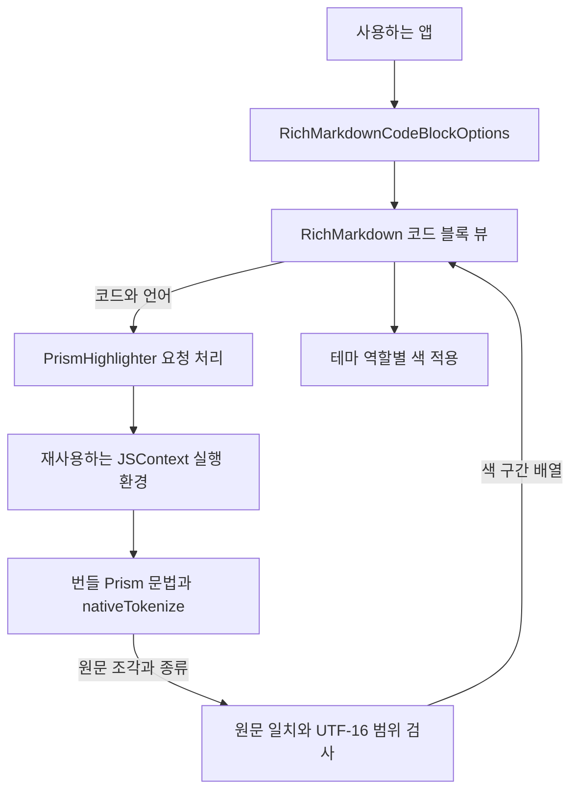

# RichMarkdownHighlight 아키텍처

기준일: 2026-10-06

`RichMarkdownHighlight`는 코드에 문법별 색을 적용하기 위해 선택적으로 추가하는 SwiftPM product입니다. product는 앱이나 다른 패키지에 공개하는 사용 단위입니다. 코드 분석 라이브러리인 Prism이 키워드·문자열·주석 같은 조각(토큰)으로 원문을 분류하면, 이 모듈은 각 조각의 원문 위치와 역할을 돌려줍니다.

코드 원문을 HTML로 바꾸지 않으며 화면 구성과 실제 색 선택은 `RichMarkdown`이 맡습니다. 이 문서는 현재 소스의 구조를 설명하며 이번 윤문에서 새로 실행한 빌드·테스트 결과를 포함하지 않습니다. 기존 실행 결과는 [검수 기록](../validation.md)을 따릅니다.

관련 문서: [명세](../spec/RichMarkdownHighlight.md) · [ADR](../adr/README.md#richmarkdownhighlight-adr) · [개선안](../improvements/RichMarkdownHighlight.md) · [코드 블록 확장 안내](../../CODE_BLOCK_EXTENSIONS.md)

## 1. 의존성과 책임

[Package.swift](../../../Package.swift)는 `RichMarkdownHighlight`가 `RichMarkdown`에 의존하고, JavaScript를 실행하는 Apple 프레임워크인 `JavaScriptCore`를 링크하며 `Resources/Prism`을 `.copy`하도록 선언합니다. 배포 기준은 iOS 16입니다. 별도 UI를 제공하지 않고 앱이 코드 분석 객체인 하이라이터를 전달해 사용합니다.

`JSContext`는 JavaScript 코드와 변수를 유지하는 실행 환경입니다. `PrismHighlighter` actor가 이 실행 환경을 한 곳에서 관리해 여러 요청이 동시에 사용하지 않도록 합니다. actor는 공유 상태 접근을 보호하는 Swift 타입이며 전용 스레드 하나를 의미하지는 않습니다.

반환하는 위치는 UIKit의 `NSRange`와 같은 UTF-16 단위입니다. UTF-16은 문자를 16비트 단위로 표현하는 방식이며, 이모지 하나가 두 단위를 차지할 수 있으므로 글자 수로 바꿔 세지 않습니다. 아래 그림의 범위 검사는 이 기준에 맞는지 확인하는 단계입니다.

화살표는 호출·데이터 전달 관계입니다. JavaScriptCore 객체는 actor 안에만 보관하며 외부에는 원문 위치와 색 역할을 담은 `RichMarkdownHighlightSpan` 값만 전달합니다. span은 원문에서 색을 적용할 구간을 뜻합니다. 다이어그램 렌더러가 담당하는 언어는 먼저 다이어그램 뷰로 분기하므로 일반 코드 색 적용 경로와 구분됩니다.

| 구성요소 | 책임 | 근거 |
| --- | --- | --- |
| `PrismHighlighter` | 입력 제한·언어 별칭 처리, 요청 순차 실행, 실행 환경 재사용, 실패 시 색 없는 결과 반환 | [PrismHighlighter.swift](../../../Sources/RichMarkdownHighlight/PrismHighlighter.swift) |
| `nativeTokenize` | 토큰 안의 자식 토큰을 순서대로 펼쳐 `{ content, kind }` 조각 배열 생성 | [native-tokenize.js](../../../Sources/RichMarkdownHighlight/Resources/Prism/native-tokenize.js) |
| `RichMarkdownSyntaxHighlighting` | 원문·언어에서 비동기로 색 구간 배열을 얻는 공개 계약 | [RichMarkdownCodeBlockOptions.swift](../../../Sources/RichMarkdown/RichMarkdownCodeBlockOptions.swift) |
| `RichMarkdownHighlightSegments` | 범위를 정렬·검사하고 색 구간과 일반 구간을 나눔 | [RichMarkdownCodeBlockOptions.swift](../../../Sources/RichMarkdown/RichMarkdownCodeBlockOptions.swift) |
| SwiftUI·UIKit 코드 블록 | 먼저 원문을 표시한 뒤 색만 반영 | [RichMarkdownView.swift](../../../Sources/RichMarkdown/RichMarkdownView.swift), [RichMarkdownUIView.swift](../../../Sources/RichMarkdown/RichMarkdownUIView.swift) |

## 2. 한 요청의 흐름

1. actor가 작업을 시작할 때 `Task.isCancelled`를 확인합니다. 이미 취소된 요청은 원문을 문법별 조각으로 나누는 토큰화를 수행하지 않습니다.
2. 언어를 소문자로 바꾸고 별칭을 문법 이름으로 치환합니다. 빈 코드나 100,000 UTF-16 단위를 초과한 코드는 `[]`를 반환합니다.
3. 실행 환경이 없으면 패키지에 포함된 번들 스크립트를 의존 순서대로 읽습니다. `clike`, `markup`, `javascript`, `c`를 자신을 확장하는 문법보다 먼저 읽습니다.
4. 사용자 코드는 `nativeTokenize`의 문자열 인자로 전달합니다. `evaluateScript`에 이어 붙이지 않습니다.
5. 토큰 조각의 `content.utf16.count`를 누적해 `NSRange`를 계산합니다. 매핑된 색 범위는 `Range(_:in:)`으로 다시 검사합니다.
6. 조각을 합친 문자열과 원문의 UTF-16 값이 정확히 같으면 색 구간을 반환합니다. 누락·오류·미지원 문법이 있으면 부분 결과를 쓰지 않고 전체 빈 배열 `[]`를 반환합니다.

`loadedContext`는 초기화가 모두 성공한 뒤에만 실행 환경을 저장합니다. `reset()`은 저장한 실행 환경을 해제하며 다음 요청에서 다시 만듭니다. 실행 환경을 참조하는 `JSValue`나 네이티브 콜백을 외부에 보관하지 않습니다.

## 3. UTF-16과 원문 보존

UTF-16은 문자를 16비트 단위로 표현하는 방식입니다. UIKit의 `NSRange`는 이 단위의 위치와 길이를 사용하며, 화면에서 보이는 글자 수와 다릅니다. 가상 예시 `A😀B`는 Swift `Character`로 글자 3개지만 UTF-16 길이는 4입니다.

이모지의 범위는 `(location: 1, length: 2)`, 뒤의 `B`는 원문 시작부터 센 위치(offset) 3입니다. 조각마다 글자 수를 세는 Swift `String.count`를 누적하면 뒤의 범위가 밀립니다. UTF-8 바이트 위치도 이 UTF-16 위치로 그대로 사용할 수 없습니다.

그림의 네 칸은 UTF-16 단위입니다. 이모지가 가운데 두 칸을 차지하므로 뒤의 `B`가 위치 3에 있다는 점과, 모든 조각을 합쳐 원문을 다시 확인하는 과정을 보여줍니다. Prism이 이 원문에 특정 색을 부여한다는 뜻은 아니며, 실제 한글·이모지 범위 확인은 [koreanAndEmojiRangesStayOnCharacterBoundaries](../../../Tests/RichMarkdownHighlightTests/PrismHighlighterTests.swift#L116) 테스트 코드에 있습니다.

Prism 검사에서는 토큰 조각이 빠지지 않았는지와 범위가 유효한지 확인합니다. 결과를 사용하는 렌더러도 길이 0, 범위 밖, 겹친 범위를 버립니다. 두 번의 검사는 원문 글자를 유지하기 위한 것이며, Prism의 모든 문법 분류가 의미적으로 정확하다는 보장은 아닙니다.

## 4. 색 역할과 문법

Prism의 토큰 이름을 키워드(`keyword`), 문자열(`string`), 주석(`comment`), 숫자(`number`), 타입(`type`), 함수(`function`), 속성(`property`) 일곱 역할로 통일합니다. 역할이 없는 조각은 본문 색을 유지하고 연산자(`operator`)와 구두 기호(`punctuation`)는 의도적으로 색을 주지 않습니다. 점 표기 토큰은 첫 분류에 대응시키며, 예를 들어 `string.special`은 `string`입니다.

번들에는 Swift, JavaScript·JSX, TypeScript·TSX, Python, JSON, Bash, Kotlin, Java, C·C++, Go, Rust, SQL, YAML, CSS, 태그 문법인 markup과 기반 문법 `clike`가 포함됩니다. `JS`처럼 대소문자만 다른 입력은 소문자로 통일합니다. `c++ → cpp`, `golang → go`처럼 Swift에서 바꾸는 별칭과 Prism 문법이 직접 등록한 `js`, `py`, `sh` 등의 별칭은 구분합니다.

유사 이름의 별칭은 어떤 문법을 선택할지 정하는 용도이며, 그 언어 전체의 의미 분석을 보장하지 않습니다.

Prism 버전·원본 관리 근거는 [코드 블록 확장 안내](../../CODE_BLOCK_EXTENSIONS.md)에 있으며, 재현 가능한 로드 목록은 [PrismHighlighter.swift](../../../Sources/RichMarkdownHighlight/PrismHighlighter.swift)의 `scripts`입니다.

## 5. 취소·늦은 결과·수명

하이라이터 actor는 동기 JavaScript 토큰화 중 `await`로 작업을 양보하지 않습니다. 따라서 하나의 실행 환경에서 요청을 동시에 실행하지 않지만, 시작한 토큰화를 취소하거나 실행 시간을 제한하지는 않습니다. 현재 상한은 입력 길이 제한이며, 엄격한 실행 시간 보장은 [별도 개선안](../improvements/RichMarkdownHighlight.md#ih-01-코드-분석-시간과-실행-중-취소)을 참고합니다.

| 경계 | 현재 확인하는 것 | 한계 |
| --- | --- | --- |
| actor 작업 시작 | `Task.isCancelled`로 취소 여부를 확인합니다. | 실행 중인 JavaScript는 중단하지 않습니다. |
| UIKit 결과 반영 | 취소 여부, 뷰가 남아 있는지, 현재 텍스트와 요청 코드가 같은지 확인합니다. | 원문을 기준으로 확인하며 별도 요청 순서번호(generation)는 없습니다. |
| SwiftUI 결과 반영 | `.task(id:)` 취소 여부와 코드·언어·하이라이터 객체 참조가 모두 같은지 확인합니다. | 이미 실행 중인 JavaScript를 중단하는 기능은 아닙니다. |

개선 전에는 같은 원문의 언어를 바꾸거나 하이라이터만 교체하면 SwiftUI에 이전 색이 남는 경로가 있었습니다. 현재 `HighlightRequest`는 코드·언어·하이라이터 객체 참조를 함께 비교하고, `loadHighlight`가 새 요청 시작 시 이전 `highlight`를 지웁니다. 이 비교 기준을 요청 식별 기준(identity)이라고 하며, 결과 표시와 `await` 이후에도 같은 기준을 확인합니다.

빈 결과나 하이라이터 제거 시에는 색 없는 원문을 유지합니다. 이것은 하이라이터 엔진의 반환 계약과 별개인 소비 뷰의 수정이며, [RichMarkdownView.swift](../../../Sources/RichMarkdown/RichMarkdownView.swift)의 `HighlightRequest`, `attributedCode`, `loadHighlight`와 [렌더러 개선 기록](../improvements/RichMarkdown.md#render-imp-02-swiftui-코드-색-결과의-요청-일치-확인)에 근거가 있습니다.

## 6. 안전 경계와 확인 범위

사용자 코드를 스크립트 문자열에 삽입하지 않고 HTML도 만들지 않으므로 이 모듈에는 HTML 삽입 지점이 없습니다. 번들 문법은 문자열 패턴을 찾는 정규식으로 코드 데이터를 분석합니다. 이 구조는 사용자 코드를 실행할 코드로 취급하지 않기 위한 것이며, 정규식의 실행 비용이나 번들 자체 취약성까지 제거한다는 주장은 아닙니다.

[PrismHighlighterTests](../../../Tests/RichMarkdownHighlightTests/PrismHighlighterTests.swift)는 번들 JavaScriptCore 실행, 문법·별칭, 한글·이모지, 실패 시 색 없는 결과 반환과 실행 환경 초기화를 확인하도록 작성되어 있습니다. [CodeBlockExtensionTests](../../../Tests/RichMarkdownTests/CodeBlockExtensionTests.swift)는 소비 렌더러의 범위 검사와 원문 보존, UIKit 색 반영을 다룹니다. 이번 문서 윤문에서는 테스트를 새로 실행하거나 실행 시간·메모리·화면 접근성을 측정하지 않았으며, 기존 실행 결과는 [검수 기록](../validation.md)을 따릅니다.
