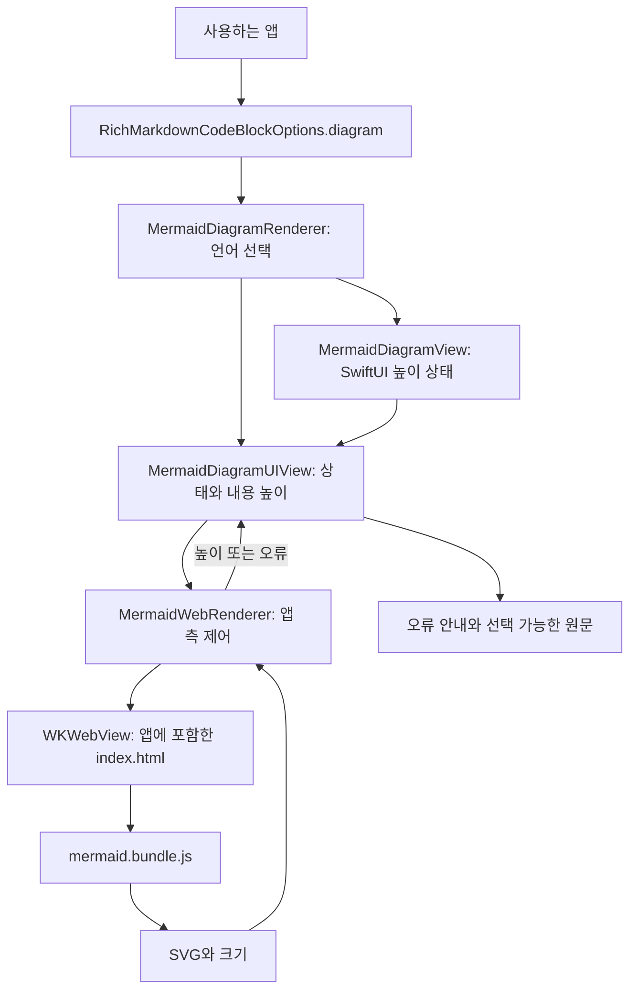
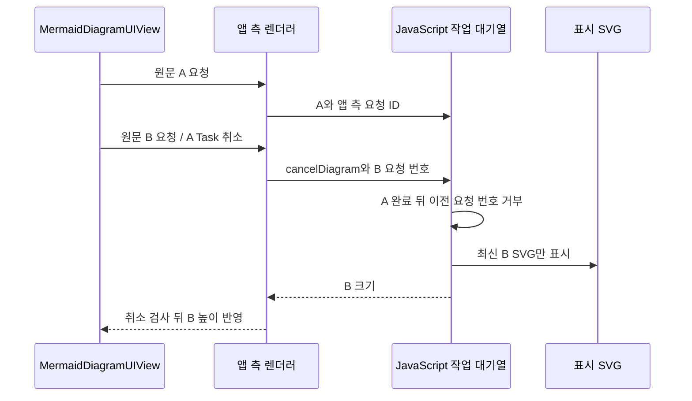

# RichMarkdownMermaid 아키텍처

기준일: 2026-10-06

`RichMarkdownMermaid`는 Mermaid 코드 블록의 본문을 다이어그램으로 표시하는 선택형 모듈입니다. Swift Package의 공개 라이브러리(product)로 따로 제공하므로 다이어그램이 필요한 앱만 추가할 수 있습니다. 예를 들어 `mermaid` 코드 블록을 만나면 본문은 그림으로 바꾸고, `RichMarkdown`이 제공하던 언어 헤더와 원문 복사 버튼은 유지합니다.

다이어그램은 앱에 포함한 Mermaid JavaScript 코드로 만듭니다. 결과 형식인 SVG는 확대해도 선과 글자가 선명한 벡터 그림입니다. 앱 안에서 웹 내용을 표시하는 Apple 구성 요소인 WebKit을 사용하며, 실제 화면은 `WKWebView`에 표시합니다.

이 모듈은 표시와 높이 측정을 맡고, 실패하면 선택 가능한 원문을 보여 줍니다. 큰 입력은 실패 표시에서 앞부분만 보여 주며 원문 전체와 복사 기능은 유지합니다. 사용자 요청에 따라 개선한 현재 구조를 설명하며 테스트 작성과 실제 실행 결과는 [검수 기록](../validation.md)에서 구분합니다.

관련 문서: [명세](../spec/RichMarkdownMermaid.md) · [ADR](../adr/README.md#richmarkdownmermaid-adr) · [개선안](../improvements/RichMarkdownMermaid.md) · [코드 블록 확장 안내](../../CODE_BLOCK_EXTENSIONS.md)

## 1. 연결 구조

[Package.swift](../../../Package.swift)는 `RichMarkdownMermaid → RichMarkdown` 의존 관계, `WebKit` 연결, `WebAssets` 리소스 복사를 선언합니다. 사용하는 앱의 최소 지원 버전은 iOS 16입니다. JavaScript를 빌드하는 `Web` 폴더는 Swift 컴파일 대상에서 제외합니다. Mermaid 버전 `11.17.2`와 JavaScript 묶음 파일을 만드는 도구인 esbuild `0.28.2`는 [Web/package.json](../../../Sources/RichMarkdownMermaid/Web/package.json)에 고정되어 있습니다.

아래 그림에서 `MainActor`는 화면과 관련된 Swift 코드를 메인 실행 영역에서 다루게 하는 규칙입니다. 이 문서의 앱 측(native)은 Swift 코드, 웹 측은 `WKWebView` 안에서 실행되는 JavaScript 코드를 뜻합니다.

화살표는 객체 생성, 함수 호출, 결과 전달 관계를 나타냅니다. 앱 측 렌더러는 SVG를 Swift로 복사하거나 이미지로 변환하지 않습니다. SVG는 같은 `WKWebView`의 `#diagram` 영역에 표시하고 Swift에는 크기만 돌려줍니다.

| 타입 | 책임 | 근거 |
| --- | --- | --- |
| `MermaidDiagramRenderer` | 처리할 코드 블록 언어를 정하고 UIKit·SwiftUI 뷰를 만듭니다. | [MermaidDiagramRenderer.swift](../../../Sources/RichMarkdownMermaid/MermaidDiagramRenderer.swift) |
| `MermaidDiagramUIView` | 뷰가 창에 붙었는지와 폭을 확인하고, 비동기 작업인 `Task`·높이·실패 표시·재시도를 관리합니다. | [MermaidDiagramUIView.swift](../../../Sources/RichMarkdownMermaid/MermaidDiagramUIView.swift) |
| `MermaidDiagramView` | UIKit에서 측정한 높이를 SwiftUI 상태와 `frame(height:)`에 전달합니다. | [MermaidDiagramView.swift](../../../Sources/RichMarkdownMermaid/MermaidDiagramView.swift) |
| `MermaidWebRenderer` | 입력을 검사하고 앱에 포함한 페이지를 불러옵니다. WebKit의 완료·실패 알림(delegate)을 받고 JavaScript를 호출해 결과 크기를 검사합니다. | [MermaidWebRenderer.swift](../../../Sources/RichMarkdownMermaid/MermaidWebRenderer.swift) |
| `index.html` | Mermaid를 초기화하고 SVG를 표시합니다. 사용 가능한 폭에 맞춰 크기를 계산하고 웹 자원 실행 제한 규칙인 CSP를 적용합니다. | [index.html](../../../Sources/RichMarkdownMermaid/Resources/WebAssets/index.html) |

## 2. 렌더 요청과 높이

기본 처리 언어는 `mermaid`입니다. 렌더러 생성자와 `RichMarkdownCodeBlockOptions`는 언어를 소문자로 바꿔 비교하므로 대소문자를 구분하지 않습니다. 다른 언어와 언어가 없는 블록은 기존 방식대로 코드로 표시합니다.

`MermaidDiagramUIView`는 폭이 1보다 크고 앱의 창(window)에 붙은 뒤 렌더링을 시작합니다. 초기 높이 상수는 64입니다. 실패 안내가 더 높으면 그 내용을 담는 데 필요한 높이(fitting height)를 사용합니다.

같은 내용을 다시 그리지 않도록 입력을 묶어 비교하는 값을 렌더 키라고 부릅니다. 여기에는 원문 `source`, 다크 모드 여부, 소수점 아래를 버린 폭, Dynamic Type에 따른 본문 글자 크기를 넣습니다. Dynamic Type은 사용자의 시스템 글자 크기 설정을 반영하는 기능입니다. 화면 배치를 다시 계산해도 키가 같으면 렌더 요청을 생략합니다. 키가 바뀌면 기존 `Task`를 취소하고 새 작업을 만듭니다. `source`·`theme` 속성을 변경하면 저장한 키를 비우므로 테마가 다르면 글자 크기가 같아도 다시 요청합니다.

렌더러는 공백만 있는 `source`를 거절하고 UTF-8로 표현했을 때 20,000바이트를 넘는지 확인합니다. 폭은 소수점 아래를 버린 뒤 120...2,000으로 제한합니다. 앱에 포함한 페이지를 불러온 후 `window.renderDiagram`에 `source`·`dark`·`width`·`fontSize`를 인자로 전달합니다.

페이지는 다음 규칙으로 높이를 계산합니다.

1. 요청을 받을 때 현재 결과를 구분하는 번호인 generation을 증가시킵니다. JavaScript의 `Promise`는 나중에 완료될 결과를 나타냅니다. 페이지별로 이 작업들을 대기열(queue)에 연결해 글꼴 준비, `initialize`, `render`를 순서대로 실행합니다. SVG 자체를 구분하는 ID의 일련번호는 별도로 증가시킵니다.
2. 보안 모드인 strict와 `htmlLabels: false`, `maxTextSize: 20000`, `maxEdges: 200` 등의 설정으로 SVG를 만듭니다. `htmlLabels`는 HTML 라벨 사용 여부, `maxTextSize`는 원문 길이 제한, `maxEdges`는 도형 간 연결 수 제한입니다.
3. `await`로 기다리던 작업이 끝날 때마다 현재 요청 번호를 확인합니다. 화면에 내보내기 전 검사하는 숨긴 임시 영역(staging)에서 크기를 측정하고 브라우저의 화면 갱신 단위인 frame을 기다립니다. 마지막 검사까지 통과한 최신 결과만 DOM, 즉 웹 문서의 화면 구조에 넣습니다. SVG가 원래 차지하는 크기인 자연 크기를 확인해 사용 가능한 폭보다 넓으면 줄이고, 좁으면 확대하지 않으며 좌우 중앙에 놓습니다.
4. SVG 본문 높이가 4,000 이하인지 확인하고 여백 32를 더해 돌려줍니다.
5. Swift는 높이가 무한대나 NaN(숫자로 표현할 수 없는 값)이 아닌 유한값(finite)이고, 양수이며, 4,032 이하인지 확인한 뒤 올림합니다.

높이 변화가 0.5보다 크면 UIKit이 내용에 따라 요청하는 크기(intrinsic content size)를 다시 계산하도록 알리고 `onSizeChange`를 호출합니다. UIKit 뷰를 SwiftUI에 연결하는 뷰는 같은 기준으로 `@State height`를 바꿔 `frame(height:)`에 높이를 지정합니다. 여기서 SwiftUI의 `frame(height:)`는 브라우저의 화면 갱신 단위인 frame과 다른 의미입니다. 원문 복사 버튼과 언어 헤더는 `RichMarkdown`의 기존 코드 블록에 남습니다.

## 3. 취소와 늦은 결과의 반영 경계

초기 페이지를 불러올 때 여러 호출이 겹쳐도 페이지 로드는 한 번만 진행합니다. 한 로드 작업(navigation)에 요청 번호와 타이머를 연결하고, 완료를 기다리는 개별 호출(waiter)은 고유 식별자인 UUID로 구분합니다. 한 호출을 취소하면 그 대기만 끝내고 다른 호출은 계속 기다립니다. 마지막 대기까지 취소되면 페이지 로드를 중단합니다.

완료 알림(callback)이 어느 로드 작업에서 왔는지와 시간 제한 타이머가 어느 요청 번호에 속하는지 확인합니다. 따라서 이전 로드의 늦은 알림이나 타이머가 새 대기를 끝내지 않습니다.

같은 렌더러에 새 요청이 들어오면 이전 요청의 앱 측 렌더 대기를 `CancellationError`로 끝냅니다. 앱 측 요청 ID와 별도로, 페이지도 현재 요청 번호인 generation을 확인해 최신 결과만 화면에 반영합니다. 기다리던 작업이 끝나는 각 `await` 뒤에 번호를 다시 확인합니다.

Mermaid 엔진은 SVG를 만드는 JavaScript 코드입니다. 이 엔진의 전역 `initialize` 설정이 서로 덮어쓰이지 않도록 같은 페이지에서는 작업을 하나씩 순서대로 실행합니다. SVG ID는 도형 정의 등을 고유하게 구분하는 용도이고, 결과가 최신인지 확인하는 번호(token)와 다릅니다.

Swift `Task`를 취소하고 요청 번호를 무효화해도 실행 중인 JavaScript가 강제로 멈추지는 않습니다. 진행 중 렌더링을 취소하거나 완료 대기 시간 제한(deadline)을 넘기면 페이지를 dirty 상태로 표시합니다. 이는 다음 요청 전에 페이지를 다시 불러와야 한다는 뜻입니다. 다음 요청은 페이지를 새로 불러오므로 끝나지 않는 `Promise` 때문에 멈춘 대기열에서 벗어날 수 있습니다.

`source`·`theme`가 바뀌면 즉시 로딩 상태로 전환해 이전 그림과 접근성 내용을 가립니다. 브라우저의 화면 갱신을 기다릴 수 있도록 `WKWebView` 자체는 투명한 활성 상태로 두고, 결과가 확정될 때만 보여줍니다.

이전 SVG를 웹 문서 구조(DOM)에서 즉시 삭제하는 규칙은 아닙니다. 웹 화면을 숨긴 뒤 최신 결과가 확정되면 기존 그림을 교체합니다.

## 4. 실패·timeout·재시도

| 구간 | 현재 동작 | 제약 |
| --- | --- | --- |
| 입력 검사 | 빈 `source`나 UTF-8 길이 초과를 오류로 반환합니다. | JavaScript 페이지도 별도로 20,000 단위 길이 검사를 합니다. |
| 초기 페이지 로드 | 한 로드 작업의 완료를 함께 기다리고 15초를 넘으면 `loadTimeout`을 반환합니다. | 렌더링 전체를 15초로 제한하는 것은 아닙니다. |
| JavaScript 렌더링 | WebKit·JavaScript 오류, 크기 오류, `renderTimeout`을 전달합니다. | 렌더링에 별도 15초 제한을 둡니다. 다음 요청은 페이지를 다시 불러옵니다. |
| 뷰의 일반 실패 | 오류 안내와 원문의 앞부분(prefix)을 UTF-8 20,000바이트까지 표시하고 생략 표식을 붙입니다. | 같은 키를 자동으로 반복 재시도하지 않습니다. |
| 콘텐츠 프로세스 종료 | 웹 내용을 실행하는 프로세스가 끝나면 `isLoaded`를 해제하고 뷰에 알립니다. 연속 종료에는 한 번 재시도합니다. | 성공하거나 새 `source`·`theme`가 들어오면 재시도 횟수를 다시 사용할 수 있습니다. |
| `Task` 취소 | 뷰가 취소 오류나 취소 상태를 확인하면 결과 반영을 중단합니다. | 앱 측 로드·렌더 대기를 즉시 끝내고 JavaScript의 표시 요청 번호를 무효화합니다. JavaScript 강제 중단은 아닙니다. |

로드와 렌더링에 각각 15초 제한을 두므로 최초 요청 전체가 15초 안에 끝난다는 보장은 아닙니다. 실패한 뒤 다른 입력을 넣으면 같은 `WKWebView`에 렌더링을 다시 요청할 수 있습니다. 문법 오류 뒤 복구를 확인하는 코드는 [invalidSourceFailsThenRendererRecovers](../../../Tests/RichMarkdownMermaidTests/MermaidRendererTests.swift)에 있습니다. 추가한 회귀 테스트는 시간 초과 후 복구, 동시에 로드를 기다리는 호출의 개별 취소, 끝나지 않는 JavaScript 대기의 취소를 다룹니다. 테스트 코드가 있다는 사실과 실제 실행 성공은 구분합니다.

## 5. WebKit 안전 경계

각 렌더러는 자신의 `WKWebView`를 소유하며 `WKProcessPool`을 별도로 지정하지 않습니다. 웹 데이터를 디스크에 영구 저장하지 않는 비영구 website data store를 사용하고, JavaScript가 자동으로 새 창을 여는 동작을 막습니다. 앱에 포함한 index 페이지를 `loadFileURL`로 불러오며 그 폴더만 파일 읽기 허용 범위(read access)로 지정합니다. 사용자 Mermaid 원문은 `callAsyncJavaScript`의 인자로 전달하고 스크립트 문자열에 합치지 않습니다.

CSP(Content Security Policy)는 웹 페이지가 실행하거나 불러올 수 있는 스크립트와 자원의 출처를 제한하는 규칙입니다. 이 페이지는 네트워크 연결, 외부 기본 자원, `object`를 막습니다. 스크립트는 앱에 포함한 묶음 파일(bundle)과 내용이 정확히 일치하는 초기 실행 코드(bootstrap)만 허용합니다. 코드 일치는 SHA-256 해시로 확인하며, HTML 속성에 적는 이벤트 코드(inline event)는 차단합니다. SVG에 필요한 인라인 스타일과 `data` 형식의 이미지·글꼴은 계속 허용합니다.

페이지 이동을 판단하는 navigation delegate는 `fileURL`이면서 `.linkActivated`가 아닌 요청만 허용합니다. `.linkActivated`는 사용자가 링크를 눌러 시작한 이동을 뜻합니다. 모든 URL을 특정 index 파일 하나와 대조하는 허용 목록(allowlist)은 아닙니다. 사용하는 앱이 공개 `webView`의 설정을 임의로 바꾸면 이 제한도 달라집니다.

반환된 SVG 문자열은 숨긴 임시 영역에서 웹 문서 구조로 해석하고, 마지막 요청 번호 검사 뒤 표시 영역으로 옮깁니다. 임시 영역은 보안 격리 공간이 아닙니다. 이전 strict 설정만으로는 원문 속 설정이 HTML 라벨을 켜 임시 라벨의 이벤트 코드를 실행할 수 있었습니다. 따라서 최상위(root)·flowchart의 HTML 라벨을 끄고 `htmlLabels`·`dompurifyConfig`를 `secure` 목록에 넣어 원문으로 바꾸지 못하게 했습니다. CSP도 인라인 이벤트 실행을 별도로 차단합니다.

sanitizer는 위험한 태그나 속성을 제거하는 코드입니다. Swift에서 별도의 sanitizer를 추가하지는 않았습니다. 확인한 공격과 회귀 테스트, 아직 확인하지 않은 전체 공격 사례 모음(corpus)의 범위는 [IM-04](../improvements/RichMarkdownMermaid.md#im-04-임시-html-label-이벤트-실행과-안전-설정-잠금)에 기록합니다.

## 6. 표시·접근성·수명

시스템 다크 모드에 따라 Mermaid의 dark/default 테마를 선택하고, Dynamic Type을 반영한 본문 글자 크기를 다이어그램 라벨에 전달합니다. 화면의 밝기·글자 크기 같은 환경 정보(trait) 변경을 받을 때 iOS 17의 등록 방식과 iOS 16의 `traitCollectionDidChange` 대체 방식을 구분합니다. Mermaid에 `RichMarkdownTheme`의 모든 색을 그대로 전달하는 API는 아닙니다. 렌더링 실패 시 대신 보여주는 코드와 안내의 글꼴·색에는 테마를 사용합니다.

`WKWebView`는 최대 5배 확대와 가로 이동을 허용하고, 세로 목록 스크롤은 바깥 뷰가 담당합니다. 웹 접근성 표기인 `role="img"`·`aria-label`은 일반적인 다이어그램 이름만 제공합니다. 화면 읽기 기능에 모든 도형과 관계의 의미를 전달한다고 보장하지 않습니다. 실패 원문은 선택 가능한 텍스트 뷰로 표시합니다.

뷰가 창에서 떨어질 때(detach), 입력이 바뀔 때, 객체가 해제될 때(`deinit`) 렌더 `Task`를 취소합니다. SwiftUI도 뷰를 제거하는 단계(dismantle)에서 작업을 취소하고 콜백을 비웁니다. 렌더러는 로드·렌더 타이머를 정리합니다.

`source` 전체와 상위 코드 블록의 원문 복사는 보존합니다. 실패 시 보여주는 텍스트만 UTF-8 20,000바이트 이내의 앞부분으로 제한합니다. 이때 Swift의 `Character` 경계에서 잘라 한글이나 여러 코드 포인트로 이루어진 이모지를 중간에 나누지 않습니다. 표시 상한이 원문 전체를 메모리에 보관하는 비용까지 제한하지는 않습니다.

## 7. 근거와 실행 한계

[MermaidRendererTests.swift](../../../Tests/RichMarkdownMermaidTests/MermaidRendererTests.swift)는 테스트 묶음(suite)을 순서대로 실행하도록 작성되어 있습니다. 번들 리소스, 입력 검사, 실제 flowchart·sequence 다이어그램, 한글 SVG, 중앙 정렬, 실패 후 복구, 코드 블록 확장 연결을 확인합니다. 로드 중 취소, 렌더 시간 초과, JavaScript의 늦은 완료, 원문 인자 전달과 안전 설정 변경 방지, 실패 원문 표시 상한을 확인하는 회귀 테스트도 추가했습니다.

Mermaid 본체는 `11.17.2`를 유지했습니다. 보안 개선을 위해 DOMPurify `3.4.16`과 JavaScript KaTeX `0.18.2`를 고정하고 번들 파일을 다시 생성했습니다. 이번 문서 윤문 작업에서는 테스트를 새로 실행하지 않았으며 기존 실행 결과는 [검수 기록](../validation.md)에서 확인합니다. 제어한 종료 알림을 사용하는 테스트는 실제 OS의 웹 프로세스 강제 종료 재현과 다릅니다. 전체 공격 사례, VoiceOver, 장시간 성능은 별도 검수 범위입니다.
