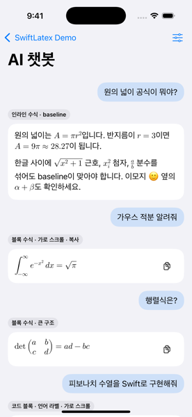
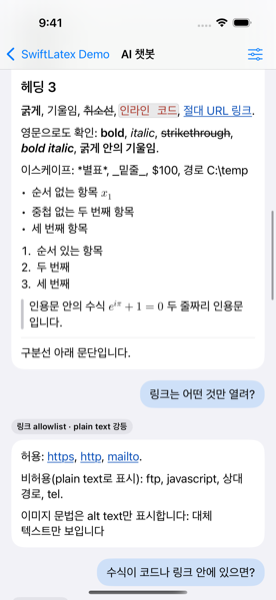
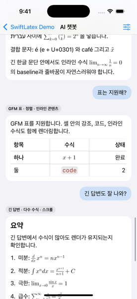
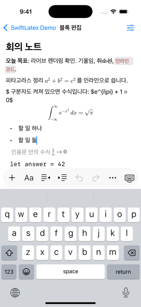
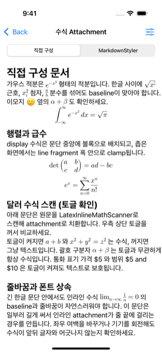
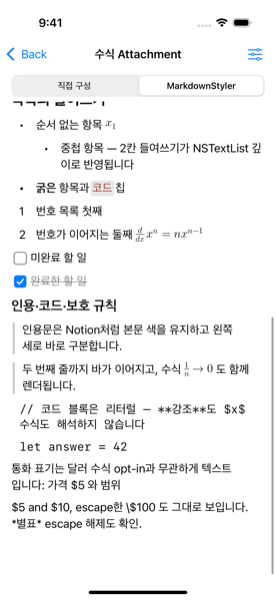
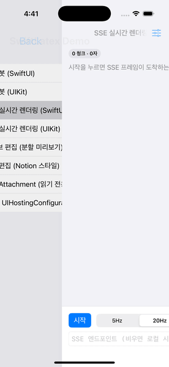
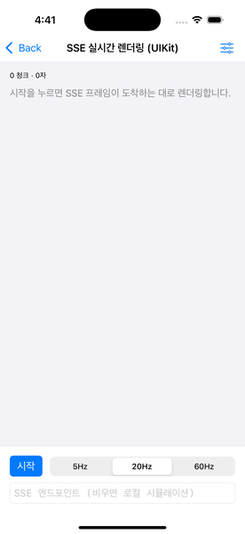

# RichMarkdown

[](https://swift.org)
[](https://developer.apple.com/ios/)
[](LICENSE)
[](CHANGELOG.md)

> **이름 변경** — 이 패키지의 이전 이름은 `SwiftLatex`다. 다음 릴리스(0.8.0)부터 product·모듈·타입
> 접두사가 `RichMarkdown`이고, 옛 타입 이름은 deprecated 별칭으로 한 버전 동안 컴파일된다.
> 대응표는 [CHANGELOG.md](CHANGELOG.md)의 Unreleased 항목.

> **0.7.0 beta** — 코드 블록 확장점 `RichMarkdownCodeBlockOptions`. `RichMarkdownHighlight`(Prism +
> JavaScriptCore)와 `RichMarkdownMermaid`(공식 Mermaid + WKWebView)를 **opt-in product**로 추가했다.
> 주입하지 않으면 코드 블록은 지금까지와 같고, `RichMarkdown` 코어는 여전히 WebView도
> JavaScript 런타임도 링크하지 않는다.
> `0.x`에서는 minor 버전에도 공개 API가 바뀔 수 있다. 변경 내역은
> [CHANGELOG.md](CHANGELOG.md)를 본다.

LLM 채팅 메시지를 네이티브로 렌더하는 Swift Package. Markdown, GFM 표, 인라인/블록
LaTeX 수식, 코드 블록을 하나의 뷰로 표시한다. SwiftUI는 `RichMarkdownView`,
UIKit은 네이티브 `RichMarkdownUIView`를 쓴다 — 두 뷰는 같은 파서·수식 raster·
generation 관리를 공유한다.

```
원의 넓이는 \( A = \pi r^2 \)입니다.
            ↓
문장 흐름 안에 baseline 정렬된 수식이 포함된 네이티브 텍스트
```

- 코어는 WebView·HTML 실행 없이 전부 `Text`, `Image`, `ScrollView`로 렌더한다.
  Mermaid 다이어그램이 필요하면 별도 product를 opt-in한다.
- 스트리밍 입력(최신 전체 `String`)을 전제로 설계했다. coalescing + latest-wins.
- 시스템 텍스트 선택, Dynamic Type, VoiceOver, light/dark를 그대로 따른다
  (선택 예외 한 건은 [알려진 제약](#알려진-제약) 참고).

## 0.7.0 베타 핵심

- **코드 블록 확장** — `RichMarkdownCodeBlockOptions` 주입 하나로 코드 블록에 색을 입히거나
  다이어그램으로 바꾼다. 두 엔진 모두 **opt-in product**라 쓰지 않는 앱은 링크하지 않는다.

  | product | 엔진 | 코드 블록 동작 |
  |---|---|---|
  | `RichMarkdownHighlight` | Prism 1.30.0 + JavaScriptCore | 문법 16종의 UTF-16 범위에 색 역할 부여 |
  | `RichMarkdownMermaid` | Mermaid 11.17.2 + WKWebView | ` ```mermaid ` 블록을 공식 다이어그램으로 교체 |

  색은 `RichMarkdownTheme.syntax`가 정하고, 실패·미지원 언어는 원문 코드 블록으로 되돌린다.
  자세한 내용은 [코드 블록 확장](#코드-블록-확장-하이라이팅과-다이어그램)과
  [Docs/CODE_BLOCK_EXTENSIONS.md](Docs/CODE_BLOCK_EXTENSIONS.md).
- **iPad 실기기 계측과 스트리밍 개선** — UIKit 렌더러가 스트리밍 중 표·코드·목록·인용 블록을
  자리에서 갱신한다(iPad Pro 실측 hitch 10건 → 3건). 데모는 넓은 화면에서 본문 열을 720pt로
  제한한다 — 레시피는 [사용법](#swiftui) 참고.

## 0.6.0 베타 핵심

- **`LatexDollarMathOptions`** — `[.single]`은 기존 `parsesDollarMath: true`와 같고, `.inlineDouble`을
  더하면 문장 안 `$$...$$`를 inline 수식으로 해석한다. `RichMarkdownView(markdown:dollarMath:)`,
  `RichMarkdownUIView.dollarMath`, `LatexInlineMathScanner.scan(_:dollarMath:)`. 스트리밍 미닫힌
  마크 억제도 `$$` opener를 같은 규칙으로 숨긴다. paragraph 전체 `$$...$$`는 그대로 block 수식이다.

## 0.5.0 베타 핵심

- **스트리밍 표시 옵션** — `.richMarkdownStreaming(_:)`(SwiftUI) / `RichMarkdownUIView.streaming`(UIKit).
  마지막 문단의 끝 12 grapheme이 옅어지고, 아직 닫히지 않은 `**`·백틱·`\(`(dollar 옵션이면
  `$`) opener는 closer가 올 때까지 숨긴다. parse 요청·cache key는 바꾸지 않는다.
- **`RichMarkdownStreamingTextBuffer`** — 100ms latest-wins 버퍼. trailing 게시로 마지막 조각도
  화면에 오른다. 호출자가 직접 10Hz 합치기를 구현할 필요가 없다.
- **스트리밍 append parse는 캐시에 넣지 않는다** — tick마다 새 키가 다른 셀의 항목을 밀어내던
  오염을 없앴다. UIKit은 스트리밍 중 같은 종류의 텍스트 블록을 새로 만들지 않고 내용만 바꾼다.

### 0.4.1

- **스트리밍 append가 이전 렌더를 유지** — 누적 문자열을 다시 넘길 때마다 문서
  전체가 원문 텍스트로 되돌아갔다가 재렌더되던 플래시를 없앴다. 새 markdown이
  표시 중 문서의 확장이면 새 parse가 게시될 때까지 이전 렌더를 그대로 보인다.
  셀 재사용(다른 문자열 교체)은 기존대로 이전 문서를 한 프레임도 보이지 않는다.
- **부분 hydration** — 캐시된 수식 raster는 파싱 게시와 동시에 hydration된다.
  스트리밍 중 이미 렌더된 수식이 원문으로 되돌아가는 프레임이 사라졌다.
- **SSE 실시간 렌더링 데모 2종(SwiftUI·UIKit)** — `text/event-stream` 프레임을
  디코딩해 누적 문자열을 넘기는 실전 배선 예제. `URLSession.AsyncBytes.lines`가
  빈 줄(이벤트 경계)을 삼키는 함정을 우회하는 줄 분리기 포함.

설계 문서: [DEVELOPMENT.md](DEVELOPMENT.md)

---

## 스크린샷

`Examples/RichMarkdownDemo`의 실제 화면. iPhone 16 Pro / iOS 18.6에서 촬영했다.
정지컷은 `RichMarkdownDemoUITests/DocumentationScreenshotTests`로 (실행법은 해당 파일 주석),
SSE 스트리밍 GIF는 `scripts/capture-sse-gifs.sh`로 재생성한다.

| 인라인·블록 수식 | Markdown 요소 |
|---|---|
|  |  |
| 문장 흐름 안에 baseline 정렬된 `\( A = \pi r^2 \)`, 가로 스크롤과 복사 버튼이 붙은 블록 수식(적분·행렬) | 헤딩, 굵게·기울임·취소선, 둥근 인라인 코드 칩, 링크, 리스트, 왼쪽 세로 바로 구분한 인용, 구분선. `\*별표\*` 같은 escape 해제도 함께 |

| GFM 표 | Notion 스타일 블록 편집 |
|---|---|
|  |  |
| 좌·중앙·우 정렬과 셀 안의 강조·인라인 코드·수식을 지원하며 좁은 화면에서는 가로 스크롤 | 하나의 연속 `UITextView`에서 제목·목록·할 일·인용·코드·수식을 편집하고 키보드 툴바로 블록과 인라인 서식을 바꾼다 |

| 수식 Attachment 직접 구성 | MarkdownStyler 읽기 전용 |
|---|---|
|  |  |
| 블록 편집기 없이 `EquationTextAttachment`를 `UITextView` 문서에 직접 넣는다. 인라인 baseline, display 블록 배치, `$` 스캔 토글, 주변 폰트를 따라가는 크기 | `MarkdownStyler.styledDocument`만으로 만든 읽기 전용 문서. 둥근 테두리/체크 완료 상태의 할 일, 왼쪽 세로 바 인용, 인라인 코드 칩, 코드 블록 리터럴 보호 |

| SSE 실시간 렌더링 (SwiftUI) | SSE 실시간 렌더링 (UIKit) |
|---|---|
|  |  |
| 5Hz SSE 프레임이 도착하는 대로 누적 문자열을 다시 넘긴다. 스트리밍 append가 이전 렌더를 유지해 원문 플래시 없이 새 블록이 이어 붙는다 | 같은 스트림을 UIKit `RichMarkdownUIView`로 배선. 스트리밍 append에서 블록 뷰를 증분 재사용한다 |

---

## 설치

`Package.swift`:

```swift
dependencies: [
    // 0.x 베타는 minor 버전에서도 공개 API가 바뀔 수 있으므로 minor로 고정한다.
    .package(url: "https://github.com/Jimmy-Jung/RichMarkdown.git", .upToNextMinor(from: "0.8.0")),
],
targets: [
    .target(name: "MyApp", dependencies: ["RichMarkdown"]),
]
```

Notion 스타일 블록 편집기가 필요하면 별도 product를 추가한다
([블록 편집기](#블록-편집기-richmarkdownblockeditor) 참고).

```swift
.target(name: "MyApp", dependencies: ["RichMarkdown", "RichMarkdownBlockEditor"]),
```

코드 블록 확장도 opt-in product다. 필요한 것만 추가한다
([코드 블록 확장](#코드-블록-확장-하이라이팅과-다이어그램) 참고).

```swift
.target(name: "MyApp", dependencies: [
    "RichMarkdown",
    "RichMarkdownHighlight",  // Prism + JavaScriptCore, 리소스 약 100 KB
    "RichMarkdownMermaid",    // 공식 Mermaid + WKWebView, 리소스 약 3.4 MB
]),
```

Xcode에서는 File → Add Package Dependencies에 저장소 URL을 넣는다.

전이 의존성은 [swift-markdown](https://github.com/swiftlang/swift-markdown)(파싱)과
[SwiftMath](https://github.com/mgriebling/SwiftMath)(수식 raster) 둘이다.

---

## 사용법

### SwiftUI

```swift
import RichMarkdown

struct MessageView: View {
    let markdown: String

    var body: some View {
        RichMarkdownView(markdown: markdown)
    }
}
```

공개 표면은 이것뿐이다.

| API | 설명 |
|---|---|
| `RichMarkdownView(markdown:parsesDollarMath:)` | 렌더 뷰. `parsesDollarMath` 기본값 `false` |
| `.richMarkdownTheme(_:)` | 색·폰트를 바꾸는 View modifier |
| `RichMarkdownTheme` | 요소별 색 8종 + 폰트 7종 + 수식 서체 |
| `RichMarkdownFont` | 폰트 지정값 (서체·Dynamic Type 기준·크기·굵기) |
| `RichMarkdownTextStyle` / `RichMarkdownFontWeight` | Dynamic Type 기준 스타일, 굵기 |
| `LatexMathFont` | 수식 서체 12종 |
| `Color.accessibleLink` | 대비 기준을 넘는 기본 링크 색 |
| `Color.inlineCodeAccent` | 대비 기준을 넘는 기본 인라인 코드 텍스트 색 |

메시지 전체의 세로 스크롤과 목록 virtualization은 소비 앱 책임이다. 뷰는 자기
콘텐츠 높이만 갖는다.

```swift
ScrollView {
    LazyVStack(alignment: .leading, spacing: 16) {
        ForEach(messages) { message in
            RichMarkdownView(markdown: message.text)
                .padding(14)
                .frame(maxWidth: .infinity, alignment: .leading)
                .background(Color(.secondarySystemGroupedBackground))
                .clipShape(RoundedRectangle(cornerRadius: 18))
        }
    }
    .padding()
}
```

뷰는 주어진 폭을 가득 채운다. iPad·가로 모드처럼 넓은 화면에서 문단·코드 블록·다이어그램이
화면 전폭으로 늘어나지 않게 하는 것은 소비 앱의 컨테이너 몫이다. Notion(708px)·GitHub(1012px)처럼
읽기 폭을 두려면 상한 프레임과 가운데 정렬 프레임을 겹친다. UIKit은 `readableContentGuide`나
같은 규칙의 `UILayoutGuide`에 `RichMarkdownUIView`를 붙인다 (데모 `DemoLayout` 참고).

```swift
LazyVStack(alignment: .leading, spacing: 16) { /* … */ }
    .frame(maxWidth: 720)        // 열 폭 상한
    .padding(.horizontal, 16)
    .frame(maxWidth: .infinity)  // 상한에 걸린 열을 가운데로
```

### 스트리밍

증분 parser는 제공하지 않는다. 호출자는 **누적된 전체 문자열**을 계속 넘긴다.
같은 뷰에 새 값이 들어오면 이전 작업을 stale로 표시하고 최신 값만 렌더한다.

```swift
@State private var answer = ""

var body: some View {
    RichMarkdownView(markdown: answer)
        .task {
            for try await chunk in client.stream(prompt) {
                answer += chunk          // 누적 문자열을 그대로 다시 넘긴다
            }
        }
}
```

토큰 이벤트는 **최대 약 10Hz로 합쳐서** 전달한다. 그보다 잦게 갱신해도 내부
coalescing이 흡수하지만(실행 1 + 대기 1), 불필요한 파싱을 줄이는 쪽이 낫다.

`RichMarkdownStreamingTextBuffer`가 그 합치기를 대신한다. 간격(기본 100ms) 안의 갱신은 마지막 값만
남기고, 간격이 끝나면 trailing 게시 1회로 흘려 보낸다 — 마지막 조각이 다음 조각까지 화면에
못 오르는 일이 없다.

```swift
@StateObject private var buffer = RichMarkdownStreamingTextBuffer()   // interval: .milliseconds(100)
@State private var isStreaming = false

var body: some View {
    RichMarkdownView(markdown: buffer.text)
        .richMarkdownStreaming(isStreaming ? .default : nil)
        .task {
            buffer.reset()
            isStreaming = true
            for try await chunk in client.stream(prompt) { buffer.append(chunk) }
            buffer.flush()
            isStreaming = false
        }
}
```

`.richMarkdownStreaming(_:)`은 스트리밍 중인 **메시지 뷰 하나**에 건다 — 컨테이너에 걸면 아래의 모든
뷰가 스트리밍으로 표시된다. 켜져 있으면 마지막 문단의 끝 12 grapheme이 옅어지고(꼬리 페이드),
아직 닫히지 않은 `**`·백틱·`\(`(dollar 옵션이면 `$`) opener는 closer가 올 때까지 숨긴다.
스트림이 끝나면 `nil`을 넘겨 원래 렌더로 돌린다. UIKit은 `RichMarkdownUIView.streaming`이 같은
역할이며, 스트리밍 중에는 같은 종류의 텍스트 블록을 새로 만들지 않고 내용만 바꾼다.

누적 갱신(새 문자열이 이전 문자열의 확장)에서는 새 parse가 게시될 때까지 **이전
렌더를 유지한다** — 갱신마다 원문 텍스트로 되돌아가는 플래시가 없다. 같은 뷰에
전혀 다른 문자열을 넣는 교체(셀 재사용)는 이전 문서를 한 프레임도 보이지 않고
즉시 원문 fallback으로 넘어간다.

SSE(`text/event-stream`) 배선 예시는 데모의 **SSE 실시간 렌더링** 화면
(`Examples/RichMarkdownDemo/Sources/SSEDemo.swift`)에 있다. 프레임 디코더는
`URLSession.bytes`와 로컬 시뮬레이션이 함께 쓰는 동기 상태 머신이다.

측정값(Debug, iPhone 16 Pro / iOS 18.6 simulator): 50 KiB 입력 parse p50 119ms,
p95 129–230ms. 10Hz로 30초 갱신 후 마지막 입력에서 idle까지 25–28ms.

### 테마

색과 폰트 모두 **요소 단위**다. 범위(문자 구간) 단위 지정은 없다.

```swift
RichMarkdownView(markdown: message)
    .richMarkdownTheme(
        RichMarkdownTheme(
            textColor: .primary,
            linkColor: .accessibleLink,
            codeBlockBackground: Color(.secondarySystemBackground),
            inlineCodeBackground: Color(.secondarySystemFill),
            inlineCodeForeground: .inlineCodeAccent,
            inlineCodeBorder: Color(.separator),
            quoteBar: Color(.systemGray3),
            codeHeaderBackground: Color(.tertiarySystemBackground),
            bodyFont: RichMarkdownFont(relativeTo: .body),
            heading1Font: RichMarkdownFont(relativeTo: .title1, weight: .bold),
            heading2Font: RichMarkdownFont(relativeTo: .title2, weight: .bold),
            heading3Font: RichMarkdownFont(relativeTo: .title3, weight: .semibold),
            heading4Font: RichMarkdownFont(relativeTo: .headline),
            codeFont: RichMarkdownFont(design: .monospaced, relativeTo: .body),
            codeLabelFont: RichMarkdownFont(design: .monospaced, relativeTo: .caption),
            mathFont: .latinModern
        )
    )
```

인라인 코드는 Notion 스타일 **칩**으로 렌더한다 — `inlineCodeBackground` 채움 +
`inlineCodeBorder` 테두리(모서리 반경 4pt) + `inlineCodeForeground` 텍스트. 기본
전경색 `Color.inlineCodeAccent`는 기본 칩 배경 대비 light 약 5.5:1, dark 약 5.7:1로
WCAG AA(4.5:1)를 넘는다. 칩을 원하지 않으면 `inlineCodeBorder`를 `.clear`로,
`inlineCodeForeground`를 `.primary`로 두면 이전(배경만) 표시에 가까워진다.

칩 드로잉 경로는 렌더러별로 다르다.

| 렌더러 | 방식 |
|---|---|
| UIKit `RichMarkdownUIView` | `.inlineCodeChip` attribute + `InlineCodeDecorationView`(TextKit 2 segment 좌표, `CAShapeLayer`) |
| SwiftUI iOS 18+ | `TextRenderer`로 같은 규격의 칩. 한 줄 안에서 폰트 fallback으로 갈라진 run은 rect를 병합 |
| SwiftUI iOS 16·17 | 사각 `backgroundColor` + 강조색 fallback (`Text` run은 둥근 칩을 그릴 수 없다) |

어느 폰트가 어디에 닿는지:

| 필드 | 적용 대상 |
|---|---|
| `bodyFont` | 본문 문단, 리스트 마커, 링크, 인라인 수식 fallback, 원문 fallback. **수식 raster 기준 크기** |
| `heading1~4Font` | 헤딩. 4단계 이하는 전부 `heading4Font` |
| `codeFont` | 인라인 코드, 코드 블록 본문, 블록 수식 fallback |
| `codeLabelFont` | 코드 블록 헤더의 언어 라벨 |
| `mathFont` | 수식 서체 (raster cache key에 포함) |

`RichMarkdownFont`는 `Font`/`UIFont`가 아니라 `Sendable` 값이다. 두 타입 사이에 손실 없는
변환이 없고 `UIFont`가 `Sendable`이 아니라서 중간 표현을 둔다. 두 렌더러가 같은 값에서
각자 폰트를 만든다.

```swift
// 커스텀 서체. 앱이 등록한 이름을 쓴다. 못 찾으면 시스템 서체로 물러난다.
RichMarkdownFont(design: .custom(name: "Georgia"), relativeTo: .body)

// 크기 고정 + 굵기. size가 nil이면 relativeTo의 기본 크기를 쓴다.
RichMarkdownFont(relativeTo: .title1, size: 34, weight: .heavy)
```

`size`를 줘도 Dynamic Type 스케일은 `relativeTo` 기준으로 계속 적용된다.
수식 크기는 `bodyFont` 크기를 따라가지만 배율 기준은 항상 `.body`다.

기본 `linkColor`는 시스템 블루가 아니다. `#007AFF`는 흰 배경에서 약 3.6:1로 본문
텍스트 대비 기준(4.5:1)에 미달해 접근성 audit에 걸린다. `Color.accessibleLink`는
light 약 7.5:1 / dark 약 8.9:1이며 밑줄도 함께 그린다.

### 달러 수식 (opt-in)

```swift
RichMarkdownView(markdown: message, parsesDollarMath: true)                       // == dollarMath: [.single]
RichMarkdownView(markdown: message, dollarMath: [.single, .inlineDouble])          // 문장 안 $$...$$도 inline
```

기본값이 `false`인 이유는 통화 표기(`$5`)와 충돌하기 때문이다. 켜도 아래 규칙으로
통화를 걸러낸다 — [수식 문법](#수식-문법) 참고.

`.inlineDouble`은 `$$...$$`를 paragraph 전체가 아닌 문장 안에서도 inline 수식으로 본다.
LLM 출력과 일부 콘텐츠 서버가 `총합($$f(1)$$)`처럼 쓰기 때문이다. `$...$`와 같은
공백·숫자·줄바꿈 규칙을 따르므로 `$$5 and $$6`은 수식이 되지 않는다. UIKit은
`RichMarkdownUIView.dollarMath`, 원문 위치가 필요한 클라이언트는
`LatexInlineMathScanner.scan(_:dollarMath:)`를 쓴다.

### UIKit

`RichMarkdownUIView`는 SwiftUI 호스팅 래퍼가 아니다. `UIView` 하위 클래스로
블록을 `UIStackView`에, 인라인 수식을 `NSTextAttachment`로 직접 배치한다.

```swift
let view = RichMarkdownUIView(markdown: message, parsesDollarMath: false)
view.theme = .default
```

Markdown chrome 없이 수식 하나만 필요한 UIKit 화면은 `LatexEquationUIView`를 쓴다.

```swift
let equationView = LatexEquationUIView(latex: #"\int_0^1 x^2 \, dx"#)
```

`markdown` setter는 입력 보호 상한을 적용한다. 따라서 getter는 원문이 아니라 실제로
렌더되는 canonical 텍스트(상한 초과 시 bounded prefix와 생략 marker)를 반환한다.

### UICollectionView 재사용

일반적인 피드에서는 셀이 재사용될 때 `markdown`을 새 메시지로 설정하면 된다. 다만
현재 세션의 메시지 ID가 고정되어 있고 이미 완성된 답변을 자주 다시 보여 주는 경우에는
소비 앱이 `message.id → RichMarkdownUIView`를 보관한 뒤 같은 뷰를 다시 부착할 수 있다.
`UIView`는 한 번에 하나의 superview만 가질 수 있으므로, 기존 셀의 제약을 deactivate하고
분리한 뒤 새 bubble에 pin해야 한다. 테마·달러 수식 설정·Dynamic Type·display scale이
바뀌면 해당 캐시는 무효화한다. 무한 피드에서는 뷰를 무제한 보관하지 말고 상한을 둔다.

`Examples/RichMarkdownDemo`의 **AI 챗봇 (UIKit)**이 이 전략을 보여 준다. 이는 패키지 API가
아니며 메시지 수명과 메모리 예산은 소비 앱이 결정한다. 옮겨 적을 때 실측으로 확인된
두 지점을 지켜야 한다.

- **늦은 `prepareForReuse`의 뷰 탈취 방지** — 화면 밖 셀은 reuse pool에서 늦게
  정리되는데, 그 사이 같은 메시지 뷰가 다른 셀로 이사했을 수 있다. detach 시
  `entry.view.superview === bubble`일 때만 `removeFromSuperview()`를 호출한다.
  무조건 제거하면 화면에 보이는 셀에서 뷰를 뜯어내 빈 버블이 남는다
  (빠른 스크롤 왕복에서 재현, 데모의 `UIKitChatCellReuseTests`가 회귀 방어).
- **prewarm 시점은 루트 화면** — SwiftMath 폰트 등록 + 메시지 raster가 화면 전환
  (0.35s)보다 오래 걸리므로, 채팅 화면 진입 직전이 아니라 앱 루트의 `.task`에서
  캐시에 markdown을 미리 주입한다. 재호출은 dedupe로 no-op다.

셀에서 쓸 때는 수식 이미지 hydration이 최초 레이아웃 뒤에 오므로,
`onContentSizeChange`로 self-sizing 재측정을 요청한다.

```swift
let registration = UICollectionView.CellRegistration<UICollectionViewCell, String> { cell, _, message in
    let view = RichMarkdownUIView(markdown: message)
    view.onContentSizeChange = { [weak cell] in cell?.invalidateIntrinsicContentSize() }
    cell.contentView.addSubview(view)
    // view를 contentView 4변에 pin
}
```

Dynamic Type·다크 모드·display scale 변경은 뷰가 trait 변화로 직접 감지해
다시 렌더한다. 소비 앱이 할 일은 없다.

SwiftUI 뷰를 호스팅해서 쓰는 경로도 그대로 유지된다.

셀:

```swift
let registration = UICollectionView.CellRegistration<UICollectionViewListCell, String> { cell, _, message in
    cell.contentConfiguration = UIHostingConfiguration {
        RichMarkdownView(markdown: message)
    }
}
```

`UIHostingConfiguration` 셀은 자체 크기 조정을 지원한다. layout이 고정 `itemSize`면
잘리므로 estimated dimension(또는 list layout)을 쓴다.

일반 화면:

```swift
let host = UIHostingController(rootView: RichMarkdownView(markdown: message))
addChild(host)
view.addSubview(host.view)
host.view.translatesAutoresizingMaskIntoConstraints = false
NSLayoutConstraint.activate([
    host.view.topAnchor.constraint(equalTo: view.topAnchor),
    host.view.leadingAnchor.constraint(equalTo: view.leadingAnchor),
    host.view.trailingAnchor.constraint(equalTo: view.trailingAnchor),
    host.view.bottomAnchor.constraint(equalTo: view.bottomAnchor),
])
host.didMove(toParent: self)
```

### 코드 블록 확장: 하이라이팅과 다이어그램

`RichMarkdownCodeBlockOptions` 하나를 주입하면 코드 블록 표시가 바뀐다. 주입하지 않으면
지금까지와 같은 plain monospace다.

```swift
import RichMarkdown
import RichMarkdownHighlight
import RichMarkdownMermaid

let options = RichMarkdownCodeBlockOptions(
    highlighter: PrismHighlighter.shared,      // ```swift 등에 색
    diagram: MermaidDiagramRenderer.shared     // ```mermaid → 다이어그램
)

// SwiftUI
RichMarkdownView(markdown: message)
    .richMarkdownTheme(.default)
    .richMarkdownCodeBlocks(options)

// UIKit
let view = RichMarkdownUIView(markdown: message)
view.codeBlocks = options
```

둘 중 하나만 넣어도 된다. `PrismHighlighter`는 번들에 고정한 Prism 1.30.0을
JavaScriptCore에서 실행하고(WebView를 쓰지 않는다), `MermaidDiagramRenderer`는 번들에
고정한 공식 Mermaid 11.17.2를 `WKWebView`에서 실행한다. 둘 다 런타임 다운로드가 없다.

**색**은 테마가 정한다. 다른 테마 값처럼 역할 단위다.

```swift
var theme = RichMarkdownTheme.default
theme.syntax.keyword = .purple
theme.syntax.comment = RichMarkdownSyntaxColors.dynamic(light: 0x6B_72_80, dark: 0x9C_A3_AF)
```

**지원 문법 16종**: swift, javascript(js), typescript(ts), jsx, tsx, python(py), json,
bash(sh/shell/zsh), kotlin(kt), java, c, cpp(c++), go, rust(rs), sql, yaml(yml),
css, markup(html/xml/svg). 목록에 없는 언어는 색 없이 원문으로 표시한다.

**실패는 전부 원문으로 되돌린다.** 미지원 언어, Prism 예외, 토큰 조각이 원문과 어긋난
경우, Mermaid 문법 오류, 크기 초과는 모두 원문 코드 블록이다. 다이어그램으로 바뀐
블록에서도 헤더의 복사 버튼은 그대로 남아 원문을 가져갈 수 있다.

**스트리밍 중**에도 안전하다. 색 범위는 그 범위를 만든 원문과 함께 보관하고, 원문이
바뀌면 버린다 — 위치가 밀린 색을 한 프레임도 보여 주지 않는다. 하이라이팅은 색만 바꾸므로
코드 블록 크기가 달라지지 않는다.

설계, 번들 출처와 SHA-256, 표시 한계는 [Docs/CODE_BLOCK_EXTENSIONS.md](Docs/CODE_BLOCK_EXTENSIONS.md)에 있다.

### 블록 편집기 (RichMarkdownBlockEditor)

Notion 스타일 블록 문서 편집기. 논리 블록(`제목·목록·할 일·인용·코드·수식`)은
모델이 유지하고, 화면에는 하나의 TextKit 2 `UITextView`만 노출해 UIKit 기본
선택기가 블록 경계와 무관하게 선택·복사·전체 선택을 처리한다. 한글 IME composition
처리와 수식 attachment ↔ 원문 전환의 선택 경계 보정을 포함한다.

```swift
import RichMarkdownBlockEditor
import SwiftUI

struct NoteEditorScreen: View {
    @State private var model: BlockEditorModel

    init(markdown: String) {
        _model = State(initialValue: BlockEditorModel(markdown: markdown))
    }

    var body: some View {
        BlockDocumentTextEditor(
            blocks: model.blocks,
            selection: model.currentDocumentSelection,
            canUndo: model.canUndo,
            canRedo: model.canRedo,
            onReplaceText: { model.replaceDocumentText(in: $0, with: $1) },
            onSelectionChange: { model.updateDocumentSelection($0) },
            onToolbarAction: perform,
            theme: .default
        )
    }

    private func perform(_ action: EditorToolbarAction, selection: NSRange) {
        model.updateDocumentSelection(selection)
        guard let active = model.blockSelection(for: selection) else { return }
        switch action {
        case let .transform(kind): model.transform(id: active.blockID, to: kind)
        case .undo: _ = model.undo()
        case .redo: _ = model.redo()
        default: break  // insert·format·indent 등은 데모 앱의 perform 참고
        }
    }
}
```

- **저장 포맷은 markdown** — `model.markdown`으로 손실 없이 직렬화된다.
  `BlockEditorModel`은 UI 의존이 없어 markdown 구조 조작 파이프라인에 단독 사용 가능.
- **키보드 툴바는 앱 책임** — `makeInputAccessory:`로 `BlockEditorInputAccessory`
  준수 뷰를 주입한다. 데모의 `BlockKeyboardToolbar`가 레퍼런스 구현이다.
- **구조 보존 복사/붙여넣기** — 전체 선택 복사 시 markdown과 함께
  `com.richmarkdown.block-document` pasteboard payload를 게시한다.
- `InlineMarkdownCodec`은 LaTeX 구간(`\(...\)`, `$...$`)을 보호하는 인라인
  markdown 파서로 단독 재사용할 수 있다.

### 데모 앱

```bash
cd Examples/RichMarkdownDemo && xcodegen generate && open RichMarkdownDemo.xcodeproj
```

루트 목록의 **AI 챗봇 (SwiftUI)**와 **AI 챗봇 (UIKit)**에서 같은 fixture를 비교한다.
인라인/블록 수식, 코드 블록, 리스트·인용, GFM 표, 링크 allowlist, 금지 문맥 보호,
실패 시 원문 표시, 다국어·RTL, 미지원 노드 강등, 긴 답변을 한 화면에서 확인한다. 두 화면의
우측 상단 `렌더 옵션` 메뉴는 `$` 수식 opt-in, 케이스 라벨, 테마 프리셋을 제공한다.

스트리밍 확인 화면 2개.

- **SSE 실시간 렌더링 (SwiftUI)** — `text/event-stream` 프레임을 받아 누적 문자열을
  `RichMarkdownView`에 계속 넘기는 화면. 엔드포인트 칸이 비어 있으면 fixture를 SSE
  프레임으로 만들어 5/20/60Hz로 로컬에서 흘린다(네트워크 불필요). 프레임 payload는
  OpenAI 호환(`choices[0].delta.content`)이며 디코더는 `choices[0].text`,
  Anthropic `delta.text`, 순수 텍스트 payload, 오류 payload도 함께 받는다.
  - **도착 속도와 화면 갱신 속도를 분리한다.** 도착한 델타를 모아 약 10Hz로만 반영한다.
    매 청크 갱신 + 자동 스크롤은 스크롤 레이아웃을 그 빈도로 강제해 메인 스레드를
    포화시키고, 렌더 게시가 계속 stale 판정을 받아 화면이 원문에 고착한다(실측).
  - 누적 갱신에서는 이전 렌더가 유지된 채 새 블록이 이어 붙는다(«스트리밍» 절의
    append 계약). 문자 수로 자르므로 구분자가 절반만 도착한 구간에서는 파싱이 끝나도
    수식이 원문으로 남는 fail-open을 볼 수 있다.
  - 엔드포인트를 넣으면 `URLSession.bytes`로 실제 스트림을 읽는다. **GET·바디 없음·인증
    헤더 없음**이라 OpenAI/Anthropic API에 직접 붙일 수 없고, GET으로 `text/event-stream`을
    중계하는 로컬 프록시를 앞에 둔다(실측: 시뮬레이터에서 `http://127.0.0.1:PORT`는 ATS
    예외 없이 붙는다. LAN·사내 평문 http는 ATS에 막히므로 예외가 필요하다).
    응답 `Content-Type`이 `text/event-stream`이 아니면 거부한다.

- **SSE 실시간 렌더링 (UIKit)** — 같은 디코더·전송 로직을 UIKit 네이티브
  `RichMarkdownUIView`로 배선한 화면. `onContentSizeChange`로 자동 스크롤을 걸고,
  스트리밍 append에서 블록 뷰 증분 재사용(0.3.0 성능 작업)이 그대로 동작하는지 확인한다.

- **라이브 편집 (분할 미리보기)** — `TextEditor` 입력이 곧바로 `RichMarkdownView`로
  흘러 타이핑으로 coalescing 동작을 확인하는 화면.

UIKit 화면 2개가 함께 들어 있다.

- **UIKit 네이티브** — `RichMarkdownUIView`를 재사용 셀에 직접 넣은 화면.
  메시지 ID별 완성 뷰를 다시 부착해 재방문 스크롤 비용을 줄인다. 테마 프리셋
  (기본 / 큰 글자 / Serif / 색 강조)을 메뉴에서 바꿔 폰트·색·수식 서체를 확인한다.
  `-richmarkdownPreset Serif` launch argument로 특정 프리셋에서 시작할 수 있다.
- **UIKit UIHostingConfiguration** — SwiftUI 뷰를 호스팅하는 셀 예제.

블록 편집기 product 화면 2개.

- **블록 편집 (Notion 스타일)** — `RichMarkdownBlockEditor`의 `BlockDocumentTextEditor`
  + `BlockEditorModel`을 배선한 편집 화면. 키보드 툴바 주입
  (`BlockEditorInputAccessory`) 레퍼런스.
- **수식 Attachment (읽기 전용)** — 블록 에디터 없이 `EquationTextAttachment`를
  임의 문서에 직접 배치하는 경로와, `MarkdownStyler.styledDocument`로 블록 모델을
  읽기 전용 렌더하는 경로를 세그먼트로 전환해 비교한다. 테마 메뉴로 attachment
  재구성(테마 캡처) 계약을 확인한다.

---

## 구동 원리

### 문제

`swift-markdown`에는 수식 AST 노드가 없다. 그래서 Markdown을 먼저 파싱하면
`\(a * b\)`의 `*`가 강조로, `\(x_[i]\)`의 `_`와 `[`가 다른 노드로 쪼개진다.
반대로 수식을 먼저 찾으면 코드 블록이나 링크 안의 구분자를 수식으로 오인한다.

### 2-pass 파이프라인

```
원문 UTF-8
   │
   ├─ 사전 byte 상한 검사
   │
   ├─ 1차 파싱  ── 수식을 찾지 않는다. 금지 문맥과 paragraph 범위만 수집
   │     ├─ hard barrier: CodeBlock, InlineCode, HTMLBlock, InlineHTML
   │     ├─ soft range:   Link, Image
   │     └─ paragraph 전체 범위 (block 수식 판정용)
   │
   ├─ 원문 전체 수식 스캔 ── Markdown 노드 분할과 무관
   │
   ├─ byte 길이를 보존하는 mask ── 수식 구간의 non-newline byte → ASCII 'x'
   │
   ├─ 2차 파싱  ── 마스킹된 버퍼. 수식 안의 Markdown 기호가 사라진 상태
   │
   └─ ParsedDocument ── 수식 자리를 원문 slice로 되돌려 채운다
```

핵심은 **mask가 UTF-8 byte 길이를 바꾸지 않는다**는 점이다. 그래서 2차 AST가 준
source range를 offset 변환 없이 원문에 그대로 쓸 수 있다. `restore(protect(s)) == s`를
byte 단위로 보장하고, property/fuzz 테스트로 고정한다.

### 금지 문맥: hard vs soft

- **hard barrier**(코드·HTML): 내부 구분자를 절대 수식으로 보지 않고, 경계를
  가로지르는 매칭도 만들지 않는다.
- **soft range**(링크·이미지): 수식 span이 그 범위를 완전히 감싸면 수식이 이기고,
  구분자가 범위 안에 있으면 수식이 아니다.

그래서 `[\(x\)](url)`은 링크로 보호되고, `\([a](b)\)`는 수식으로 렌더된다.

### 2단계 비동기 게시

`body`나 `.task`의 MainActor 구간에서 파싱·raster를 실행하지 않는다.
`.task`가 `async`라는 사실만으로 background 실행을 가정하지 않는다.

```
새 markdown 값
   │
   ├─ MainActor: generation 증가, 최신 원문을 fallback으로 즉시 표시
   ├─ 단일 worker: 실행 중 1개 + 최신 대기 1개만 유지 (latest-wins)
   ├─ off-main:  파싱
   ├─ MainActor: generation 일치 → 수식이 원문인 상태로 1차 게시
   ├─ actor:     수식 raster (cache 조회 → SwiftMath)
   └─ MainActor: generation 일치 → 이미지가 채워진 최종 게시
```

generation은 service 진입 직후, 파싱 직후, 각 수식 사이, 최종 게시 직전에 확인한다.
stale이 된 연산 결과는 UI에도 cache에도 넣지 않는다.

### 수식 raster와 cache

인라인 수식은 SwiftMath의 `MathImage.asImage()`가 준 이미지와 `LayoutInfo`를 쓴다.

```swift
Text(Image(uiImage: image))
    .baselineOffset(-layout.descent)
```

cache key는 LaTeX source, math font 식별자, 실제 point size, resolved RGBA,
inline/display mode, display scale이다. cost는 이미지 pixel byte(현재 상한
256개 / 64 MiB)이고 memory warning에서 비운다.

### 입력 보호

| 항목 | 값 | 동작 |
|---|---|---|
| 원문 UTF-8 byte | 256 KiB | 첫 파싱 전에 검사 |
| 초과 시 표시 | 64 KiB | `Character` 경계로 자르고 `… [입력 제한 초과]` 추가 |
| 수식 source byte | 4 KiB | `asImage()` 호출 전에 거부 |
| 표 | 32열 / 512셀 | 초과하면 읽을 수 있는 plain text로 낮춤 |

수치는 내부 구현이며 공개 설정으로 노출하지 않는다.
UIKit의 `RichMarkdownUIView.markdown` getter도 이 제한된 canonical 텍스트를 반환한다.

---

## 렌더 계약

### Markdown

| 지원 | 내용 |
|---|---|
| 블록 | 문단, 헤딩, 순서/비순서 리스트, 인용, 구분선, 코드 블록, GFM 표 |
| 인라인 | 굵게, 기울임, 취소선, 코드(둥근 칩), 절대 URL 링크, 줄바꿈 |
| 코드 블록 | 언어 라벨, 가로 스크롤, 복사 버튼, plain monospace |
| GFM 표 | 헤더, 셀 테두리, 좌·중앙·우 정렬, 가로 스크롤, 셀 내부 인라인 콘텐츠 |

### 수식 문법

기본:

- `\( ... \)` — 인라인. 한 logical line 안에서만 닫힌다.
- `\[ ... \]` — block. 공백을 제외한 **paragraph 전체**가 감싸진 경우만.

`parsesDollarMath: true`(= `dollarMath: [.single]`)일 때 추가:

- `$ ... $` — 인라인, `$$ ... $$` — block(paragraph 전체)
- `\$`는 구분자가 아니다
- 여는 `$` 바로 뒤, 닫는 `$` 바로 앞에 공백이 올 수 없다
- 닫는 `$` 바로 뒤에 숫자가 올 수 없다 (`$x$5` → 텍스트)
- 인라인 `$...$`는 줄바꿈을 넘지 않는다
- `$$`를 `$`보다 먼저 판정한다. 문장 안 `$$`는 `.inlineDouble`이 없으면 텍스트다

`dollarMath: [.inlineDouble]`일 때 추가:

- 문장 안 `$$ ... $$` — 인라인. 공백·숫자·줄바꿈 규칙은 `$...$`와 같다
- paragraph 전체를 감싼 `$$ ... $$`는 여전히 block이다

이 규칙으로 `$5`, `$5 and $10`은 수식이 되지 않는다. Pandoc과 동일하다고 주장하지
않는다. 구현한 규칙과 fixture가 계약이다.

### 실패 시 표시 (fail-open)

- 잘못되거나 미완성인 LaTeX → 원래 구분자를 포함한 **원문**을 표시
- 중첩 구분자 → 구간 전체를 원문으로 유지
- 미지원 Markdown 노드 → 읽을 수 있는 plain text로 낮춤. 조용히 삭제하지 않음
- 이미지 문법 → alt text만 표시
- HTML → 실행하지 않고 문자 그대로 표시
- 상한 초과 입력 → bounded prefix + 생략 marker

### 링크

자동 링크로 만드는 scheme은 `https`, `http`, `mailto`뿐이다. 상대 URL과 다른
scheme(`ftp:`, `javascript:`, `tel:` 등)은 plain text로 표시한다. 허용된 링크는
native `OpenURLAction`을 거치므로 소비 앱의 `environment(\.openURL)` override를
존중한다.

### 접근성

- 수식은 `"수식: <원본 LaTeX>"`로 읽는다. 링크가 있는 문단은 개별 link semantics를
  없애지 않도록 문단 label을 덮어쓰지 않는다.
- 복사 버튼은 native `Button` + 44×44pt hit target.
- Dynamic Type 각 단계에서 수식을 scaled point size로 다시 raster한다.

---

## 알려진 제약

- **한글은 시스템 폰트에 italic 변형이 없어 `*기울임*`이 시각적으로 적용되지 않는다**
  (iOS 제약). 영문·숫자에는 적용된다. 파서는 두 경우 모두 italic 플래그를 싣는다.
- 원격 이미지, Mermaid, 신택스 하이라이팅, 편집, macOS UI는 v1 비목표다.
- 여러 블록을 가로지르는 연속 범위 선택은 지원하지 않는다(블록 단위 시스템 선택).
- 링크·이미지 Markdown 문법 **내부**의 LaTeX는 해석하지 않는다.
- 공개 parser/AST는 없다. `RichMarkdownCore`는 내부 target이다.
- UIKit 렌더러는 리스트 마커를 baseline이 아니라 top 정렬한다(중첩 스택의
  baseline이 불안정하다). SwiftUI 렌더러는 first text baseline 정렬이다.
- **범위(문자 구간) 단위 색·폰트 지정은 없다.** 테마는 요소 단위다. 굵게·기울임·
  취소선은 Markdown 원문이 정하고 소비 앱 API로는 지정할 수 없다.
- **스트리밍 표시(`.richMarkdownStreaming`)의 미닫힌 마크 억제는 휴리스틱이다.** 파서가 `\*`·`\~`·
  백틱 이스케이프를 디코딩해 넘기므로 literal과 구분되지 않고, 스트리밍 중에는 잠시 숨겨진다.
  스트림이 끝나면(`nil`) 원문대로 보인다. `$`는 `parsesDollarMath`일 때 다음 문자가 숫자·공백이
  아닌 경우만 대상이다(`$5` 유지). 꼬리 페이드 끝의 alpha 0.2는 대비 기준 미달이지만 12 grapheme
  안의 일시 상태다. 표·코드 블록·수식 블록이 마지막이면 페이드하지 않는다.
- UIKit 스트리밍 in-place 갱신은 **구조가 같은 블록**에 한한다. 문단·헤딩, 같은 언어의 코드
  블록, 열·행 수가 같은 표, 항목 수가 같은 목록·인용은 자리에서 내용만 바꾸고, 행·항목이 늘거나
  언어가 바뀌는 tick은 그 블록 하나를 새로 만든다. 다이어그램으로 대체된 코드 블록은 tick마다
  다이어그램 뷰를 다시 만든다(WebView 재생성) — 스트리밍 중 ` ```mermaid ` 블록은 아직 최적화
  대상이 아니다.
- 인라인 코드는 감싼 블록 크기를 따르지 않고 `codeFont` 크기를 쓴다.
  헤딩 안의 인라인 코드도 `codeFont` 크기다.
- **SwiftUI 렌더러 iOS 18+에서 인라인 코드가 있는 문단은 텍스트 선택이 빠진다.**
  `.textSelection(.enabled)`이 커스텀 `TextRenderer`(칩 드로잉)를 우회하므로(실측,
  수식자 순서 무관) 그 문단만 선택 대신 칩을 택한다. 다른 문단은 그대로 선택된다.
  선택과 칩을 모두 원하면 UIKit `RichMarkdownUIView`를 쓴다.
- 칩은 좌우 2pt 바깥으로 넓혀 그린다. 행 맨 앞(x=0)의 인라인 코드는 컨테이너
  경계에서 그만큼 잘릴 수 있다.
- `.custom` 서체에서는 `weight` 지정이 무시될 수 있다(서체가 해당 굵기를 갖고 있어야 한다).

---

## 지원 matrix

| 항목 | 값 |
|---|---|
| 배포 대상 | iOS/iPadOS 16+ (선언). 실행 검증된 최소 runtime은 iOS 18.6 simulator |
| 검증 toolchain | Xcode 26.6 (17F113), Swift 6.3.3 |
| Swift tools | 6.0 (Swift Testing 사용) |
| 의존성 | swift-markdown `exact: 0.4.0`, SwiftMath `exact: 1.7.3` |

SwiftMath `1.7.2`는 `MTMathListBuilder`의 scope 버그로 Xcode 26.6에서 컴파일되지
않는다. `1.7.3`이 수정 버전이며 `MathImage.asImage()` API는 동일하다.

iOS 16 실행 검증은 호환 Xcode/runtime 또는 실기기 환경에서 별도 수행한다.

---

## 테스트와 CI

P0에서 실제 실행으로 고정한 명령 (CI simulator: iPhone 16 Pro, iOS 18.6):

```bash
# Foundation-only Core를 host에서 우선 검증
swift build --target RichMarkdownCore

# 전체 unit test — test action을 가진 package scheme은 `RichMarkdown-Package`다.
# 같은 이름의 `RichMarkdown` scheme은 library product 빌드 전용이라 test action이 없다.
xcodebuild test \
  -scheme RichMarkdown-Package \
  -destination 'platform=iOS Simulator,name=iPhone 16 Pro,OS=18.6' \
  -enableCodeCoverage YES

# UIKit lifecycle/UI test
xcodebuild test \
  -project Examples/RichMarkdownDemo/RichMarkdownDemo.xcodeproj \
  -scheme RichMarkdownDemo \
  -testPlan RichMarkdownDemo \
  -destination 'platform=iOS Simulator,name=iPhone 16 Pro,OS=18.6'
```

전체 파이프라인 + Core line coverage 80% gate:

```bash
scripts/ci-test.sh
```

스트리밍 30초 전체 측정 (기본은 CI용 5초):

```bash
TEST_RUNNER_RICHMARKDOWN_STREAM_SECONDS=30 xcodebuild test \
  -scheme RichMarkdown-Package \
  -destination 'platform=iOS Simulator,name=iPhone 16 Pro,OS=18.6' \
  -only-testing:RichMarkdownTests/StreamingBaselineTests
```

원칙:

- Swift 6 language mode와 complete concurrency는 tools 6.0 manifest가 우리 target에
  적용한다. 전역 `SWIFT_VERSION=6` override는 의존성까지 재컴파일하므로 쓰지 않는다.
- macOS host의 일반 `swift test`를 UIKit target 검증 근거로 쓰지 않는다.
- Core line coverage 80% 미만이면 `scripts/check-core-coverage.sh`가 nonzero로 종료한다.

---

## 기여

버그 리포트와 PR을 환영한다. 다음을 지켜 주면 리뷰가 빠르다.

- `scripts/ci-test.sh`가 통과해야 한다(Core coverage 80% gate 포함).
- 파서 동작을 바꾸면 `Tests/RichMarkdownCoreTests`에 fixture를 추가한다. 이 저장소에서는
  구현한 규칙과 fixture가 계약이다.
- 렌더 동작을 바꾸면 `Examples/RichMarkdownDemo` 챗봇 화면에서 눈으로 확인한다.
  실제로 이 방법으로 기울임·취소선 유실과 Markdown escape 버그를 찾았다.
- 새 기능 제안은 [DEVELOPMENT.md](DEVELOPMENT.md)의 비목표 목록을 먼저 확인한다.

## License

[MIT](LICENSE) © JunyoungJung

## Dependency licenses

- [swift-markdown](https://github.com/swiftlang/swift-markdown) — Apache License 2.0
- [swift-cmark](https://github.com/apple/swift-cmark) — 2-Clause BSD (cmark 파생)
- [SwiftMath](https://github.com/mgriebling/SwiftMath) — MIT License

번들된 JavaScript (SPM 의존성이 아니라 소스에 포함한 고정 버전):

- [Prism 1.30.0](https://github.com/PrismJS/prism) — MIT License
  (`Sources/RichMarkdownHighlight/Resources/Prism/PRISM-LICENSE.txt`, `RichMarkdownHighlight` product)
- [Mermaid 11.17.2](https://github.com/mermaid-js/mermaid) — MIT License. 번들된 전이 의존성
  64개 패키지의 고지는 `Sources/RichMarkdownMermaid/Resources/WebAssets/MERMAID-THIRD-PARTY-NOTICES.txt`
  (`RichMarkdownMermaid` product)

원본 주소와 SHA-256은 [Docs/CODE_BLOCK_EXTENSIONS.md](Docs/CODE_BLOCK_EXTENSIONS.md)에 기록했다.
